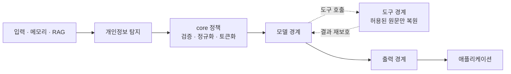

# Spring AI Privacy Guardrails

[English](README.md) | [한국어](README.ko.md) | [Documentation](https://ultramancode.github.io/spring-ai-privacy-guardrails/)

<!-- i18n-source: README.md -->
<!-- i18n-source-sha256: 1e8efc9420fbc241c0dfc5768ecc12609664799a6d571cc3d2d50f7f2f816a49 -->

<p align="center">
  
</p>

**내장 및 확장 가능한 분석기로 개인정보를 탐지하고, 원문 값이 어디까지 이동할 수
있는지 통제합니다.**

`ChatClient`에 보호를 적용하면 분석기가 탐지한 개인정보를 요청별 토큰으로 바꿔 모델에
전달합니다. 보호된 도구를 호출할 때는 정책이 허용한 엔티티 유형의 값만 실행 직전에
원문으로 복원하고, 도구 결과는 다시 보호합니다. 필요하면 최종 응답 검사도 활성화할 수
있습니다.

Spring AI Privacy Guardrails는 Spring에 의존하지 않는 개인정보 보호 `core`와 Spring AI
통합을 결합해 채팅, RAG, 메모리, 도구 호출과 출력 경계에 개인정보 보호 정책을
적용합니다.

> **프로젝트 상태:** 첫 공개 릴리스 전이며 Maven Central에는 아직 배포되지 않았습니다.
> `0.1.0` 공개 전까지 API와 설정이 바뀔 수 있으며, 별도의 마이그레이션 경로를 제공하지
> 않을 수 있습니다.
> 현재 동작은 저장소에 포함된 샘플로 확인할 수 있습니다.

## 왜 필요한가

탐지는 첫 단계입니다. 이 라이브러리는 내장 및 확장 가능한 분석기의 탐지 결과를
모델·도구·출력 경계에 적용되는 요청별 정책으로 바꿉니다.



## 샘플 실행

샘플에는 같은 입력에 항상 같은 결과를 반환하는 로컬 `ChatModel`이 포함되어 있어
클라우드 자격 증명이 필요하지 않습니다. JDK 21이 설치된 환경에서 저장소 루트의 다음
명령을 실행하세요.

```bash
./gradlew :spring-ai-privacy-guardrails-sample-demo:run
```

`http://127.0.0.1:8080`을 열면 샘플 전용 **Privacy Boundary Inspector**에서 분석기의
탐지 결과와 모델에 전달된 토큰화 입력을 확인할 수 있습니다. 또한 `CUSTOMER_ID` 원문이
허용된 도구를 호출할 때만 복원되고, 결과가 다시 보호되며, 호출이 끝나면 활성 세션 수가
0으로 돌아오는 과정도 확인할 수 있습니다.

<p align="center">
  
</p>

데모의 탐지 규칙에 해당하지 않는 텍스트는 로컬 모델이 변경하지 않고 반환할 수 있으며,
Inspector는 토큰 매핑을 노출하지 않습니다. 선택적으로 사용할 수 있는 Presidio·OpenNLP
구성, MCP 왕복 테스트와 실제 모델 연동 방법은
[샘플 가이드](samples/spring-ai-demo/README.md)에 설명되어 있습니다. 기본 저장소 검증
과정에서는 원격 모델을 호출하지 않습니다.

## 애플리케이션에 적용

다음 예제는 `ChatModel`과 `ChatClient.Builder`가 이미 구성된 Spring AI 애플리케이션에
개인정보 보호 경계를 추가합니다.

### 스타터 선택

사용할 분석기에 맞는 스타터를 선택하세요.

| 사용 사례 | 추가할 스타터 |
| --- | --- |
| 일반 개인정보 탐지에 Presidio 사용 | `spring-ai-privacy-guardrails-presidio-spring-boot-starter` |
| 정규식(Regex) 규칙 또는 사용자 정의 분석기 사용 | `spring-ai-privacy-guardrails-spring-boot-starter` |
| 호환되는 OpenNLP 모델을 보유한 JVM 전용 환경 | `spring-ai-privacy-guardrails-opennlp-spring-boot-starter` |

Presidio 스타터에는 외부 Presidio Analyzer 서비스가 필요합니다. Presidio와 OpenNLP
스타터에는 Privacy Guardrails 기본 스타터가 이미 포함되어 있으므로 이를 별도로 추가하지
마세요. 스타터 의존성을 추가하는 것만으로는 개인정보 보호 기능이나 분석기가 자동으로
활성화되지 않습니다.

### 의존성과 기본 설정

아래 의존성 좌표는 `0.1.0` 공개 후 사용할 수 있습니다. 릴리스 전에는 Maven Central에서
내려받을 수 없습니다. 외부 분석 서비스 없이 시작하려면 기본 스타터와 애플리케이션 전용
정규식 규칙을 사용할 수 있습니다.

```gradle
dependencies {
    implementation "io.github.ultramancode:spring-ai-privacy-guardrails-spring-boot-starter:0.1.0"
}
```

```yaml
spring:
  ai:
    privacy:
      enabled: true
      output:
        enabled: true
        action: tokenize
      regex:
        enabled: true
        rules:
          - entity-type: EMPLOYEE_ID
            pattern: "\\bEMP-\\d{4}\\b"
            score: 0.90
```

`output` 설정은 선택 사항이며, 생략하면 최종 응답 검사가 비활성화됩니다.

이 규칙은 `EMP-1234` 형식만 탐지하는 애플리케이션 전용 예제입니다. 일반적인 개인정보
탐지 성능을 의미하지 않으므로, 운영에 사용할 분석기는 해당 환경을 대표하는 데이터로
별도 검증해야 합니다.

### ChatClient에 보호 적용

보호할 `ChatClient.Builder`에 스타터가 제공하는 구성을 적용합니다.

```java
@Bean
ChatClient privacyChatClient(
        ChatClient.Builder builder,
        PrivacyChatClientConfigurer privacyConfigurer
) {
    return privacyConfigurer.configure(builder).build();
}
```

`PrivacyChatClientConfigurer`를 적용한 `ChatClient`만 보호됩니다. 개인정보 보호 기능을
활성화하려면 하나 이상의 분석기가 필요하며, 분석기가 없으면 애플리케이션 시작이
실패합니다. 직접 호출하는 `ChatModel`은 자동 보호 범위에 포함되지 않습니다. 파생
클라이언트, 분석기 조합과 실패 정책은 [설정 문서](docs/ko/configuration.md)를 참고하세요.

## 도구별 원문 공개

도구 등록과 개인정보 원문 공개 권한은 별개입니다. 원문 공개는 기본적으로 거부되며,
대소문자를 구분하는 정확한 도구 이름과 필요한 정규 엔티티 유형을 설정해야만 실행 직전에
해당 값을 복원합니다.

```yaml
spring:
  ai:
    privacy:
      tools:
        disclosures:
          customerLookup:
            - CUSTOMER_ID
```

도구는 `PrivacyToolCallbackFactory`로 감싸서 보호된 `ChatClient`에 등록합니다.

```java
@Bean
ToolCallback customerLookup(
        PrivacyToolCallbackFactory toolCallbackFactory,
        CustomerLookupTool delegate
) {
    return toolCallbackFactory.wrap(delegate);
}
```

보호된 `ChatClient`의 표준 도구 경로에서는 감싸지 않은 콜백을 실행 전에 거부합니다.
도구 결과는 모델이나 애플리케이션으로 전달되기 전에 다시 보호됩니다.

MCP처럼 실행 중에 도구 목록이 달라지는 `ToolCallbackProvider`는 `wrapProvider(...)`로
감쌀 수 있고, 여러 `ToolCallbackProvider`는 `wrapProviders(...)`로 결합할 수 있습니다.
사용자 정의 `ToolCallingManager`나 `ToolCallbackResolver`를 사용하는 별도 실행 경로는
애플리케이션이 보호해야 합니다. 자세한 규칙은
[도구별 원문 공개](docs/ko/configuration.md#도구별-원문-공개)를 참고하세요.

## 핵심 보호 동작

<p align="center">
  
</p>

- 보호된 각 요청은 독립된 `PrivacySession`을 사용합니다. 메모리와 RAG 콘텐츠를 포함한
  지원 형식의 모델 입력에서 탐지된 개인정보는 모델 호출 전에 토큰화됩니다.
- 보호된 도구에는 정책이 허용한 원문 값만 공개합니다. 구조화된 도구 입력에도 최소 권한을
  적용하고, `returnDirect`를 포함한 도구 결과는 모델이나 애플리케이션에 전달되기 전에
  다시 보호합니다.
- 출력 보호를 활성화하면 완성된 응답에 `TOKENIZE`, `REDACT` 또는 `BLOCK`을 적용합니다.
  스트리밍 응답은 검사를 위해 버퍼링하며, 요청이 완료·실패·취소되면 관리 중인 세션
  매핑을 정리합니다.

구성별 세부 동작은 [설정과 사용법](docs/ko/configuration.md), 요청 흐름과 모듈 역할은
[아키텍처](docs/ko/architecture.md)를 참고하세요.

## 배포 모듈

분석기별 스타터는 해당 런타임 모듈을 전이 의존성으로 가져옵니다. 테스트 지원은
애플리케이션의 테스트 범위에 별도로 추가합니다.

| 모듈 | 목적 |
| --- | --- |
| `spring-ai-privacy-guardrails-core` | 분석기 SPI, 탐지 결과 해석, 세션, 정규식과 토큰화 |
| `spring-ai-privacy-guardrails-spring-ai` | Advisor와 도구별 원문 공개 경계 |
| `spring-ai-privacy-guardrails-presidio` | Presidio Analyzer HTTP 어댑터 |
| `spring-ai-privacy-guardrails-opennlp` | 사용자 제공 OpenNLP 모델용 JVM 전용 어댑터 |
| `spring-ai-privacy-guardrails-test` | 선택형 모델·도구 프로브와 AssertJ 검증 API |

모듈의 책임과 의존성 구조는 [아키텍처](docs/ko/architecture.md)를 참고하세요. 저장소 전용
JMH 벤치마크는 라이브러리로 배포되지 않으며, 측정 대상과 실행 방법은
[평가 문서](docs/ko/evaluation.md#jmh-벤치마크)에 설명되어 있습니다.

## 호환성과 상태

| 구성 요소 | 검증한 버전 |
| --- | --- |
| Java 기준 버전 | 21 |
| Java 호환성 CI | 25 |
| Spring AI | 2.0.0 |
| Spring Boot | 4.1.0 |
| Gradle wrapper | 9.6.1 |

CI는 Java 21과 25에서 기본 검증을 실행하고, Java 21에서 Presidio 서비스와의 실제 연동
테스트와 JMH 스모크 테스트를 별도로 실행합니다.

## 상세 문서

- [설정과 사용법](docs/ko/configuration.md): 스타터, 분석기, 도구와 출력 정책
- [아키텍처](docs/ko/architecture.md): 모듈과 모델·도구·세션 실행 흐름
- [위협 모델](docs/ko/threat-model.md): 보호 대상, 신뢰 경계, 통제, 한계와 별도 관리 영역
- [평가와 벤치마크](docs/ko/evaluation.md): 검증 항목과 해석 범위
- [샘플 가이드](samples/spring-ai-demo/README.md): API, MCP와 실제 모델 연동 예제 (영문)

## 보안 경계

이 라이브러리는 지원되는 Spring AI 실행 경로에서 우발적으로 개인정보가 공개될 위험을
줄이지만, 완전한 DLP 시스템이나 법률 준수 보장은 아닙니다.

이 라이브러리는 애플리케이션의 인증·인가와 로깅 정책, 저장된 `ChatMemory`·벡터 저장소와
데이터베이스의 접근 제어 및 데이터 보존 정책을 대신 관리하지 않습니다. 분석기 품질의
검증과 조정도 운영 환경에 맞게 수행해야 합니다. 라이브러리가 명시적으로 지원하는 추론
텍스트 외의 응답 메타데이터와 비텍스트 미디어는 자동으로 보호하지 않습니다. 원격
분석기에는 인증과 전송 암호화를 적용하세요.

운영 환경에서 사용하기 전에 [보안 정책](SECURITY.md)과
[위협 모델](docs/ko/threat-model.md)을 확인하세요.

## 빌드와 검증

```bash
./gradlew --no-daemon clean check
```

이 명령은 테스트를 실행하고 저장소의 모듈과 문서를 검사합니다. 데모 분석기 회귀 테스트와
JMH 벤치마크는 [평가 문서](docs/ko/evaluation.md)를 참고하세요.

## 기여하기

[기여 가이드](CONTRIBUTING.md)를 참고하세요. 모든 기여는 Apache License 2.0으로
제공됩니다.
