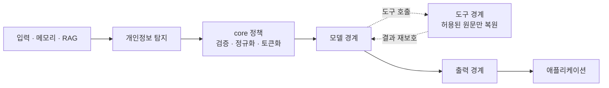
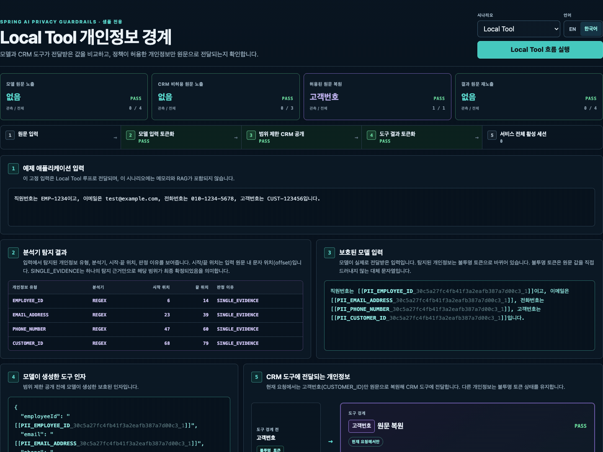

# Spring AI Privacy Guardrails

[](https://central.sonatype.com/artifact/io.github.ultramancode/spring-ai-privacy-guardrails-spring-boot-starter)
[](https://github.com/ultramancode/spring-ai-privacy-guardrails/actions/workflows/ci.yml)
[](LICENSE)

[English](README.md) | [한국어](README.ko.md) | [문서](https://ultramancode.github.io/spring-ai-privacy-guardrails/ko/)

<!-- i18n-source: README.md -->
<!-- i18n-source-sha256: cae090578572c6b130e2c01c0f661aed3addcae848d29f4f9011bd5469f13fbe -->

<p align="center">
  
</p>

<p align="center">
  Spring 공식 블로그에서 소개:
  <a href="https://spring.io/blog/2026/08/18/this-week-in-spring-august-18-2026/">This Week in Spring — August 18, 2026</a>
</p>

<p align="center">
  <strong>데모 영상:</strong>
  <a href="https://youtu.be/vir-x78e9j8">한국어</a> ·
  <a href="https://youtu.be/IeeA5ogIX_I">English</a>
</p>

**내장 및 확장 가능한 분석기로 개인정보를 탐지하고, 원문 값이 어디까지 이동할 수
있는지 통제합니다.**

`ChatClient`에 보호를 적용하면 분석기가 탐지한 개인정보를 요청별 토큰으로 바꿔 모델에
전달합니다. 보호된 도구를 호출할 때는 정책이 허용한 엔티티 유형의 값만 실행 직전에
원문으로 복원하고, 도구 결과는 다시 보호합니다. 필요하면 최종 응답 검사도 활성화할 수
있습니다.

Spring AI Privacy Guardrails는 Spring에 의존하지 않는 개인정보 보호 `core`와 Spring AI
통합을 결합해 채팅, RAG, 메모리, 도구 호출과 출력 경계에 개인정보 보호 정책을
적용합니다.

## 왜 필요한가

탐지는 첫 단계입니다. 이 라이브러리는 내장 및 확장 가능한 분석기의 탐지 결과를
모델·도구·출력 경계에 적용되는 요청별 정책으로 바꿉니다.



## 샘플 실행

샘플에는 같은 입력에 항상 같은 결과를 반환하는 로컬 `ChatModel`이 포함되어 있어
클라우드 자격 증명이 필요하지 않습니다. JDK 17이 설치된 환경에서 저장소 루트의 다음
명령을 실행하세요.

```bash
./gradlew :spring-ai-privacy-guardrails-sample-demo:run
```

`http://127.0.0.1:8080`을 열면 샘플 전용 **Privacy Boundary Inspector**를 사용할 수
있습니다. 각 화면은 샘플 백엔드가 반환한 런타임 근거를 표시합니다.

- **Local Tool**은 탐지된 원문 값이 모델 경계에서 요청 범위의 불투명 토큰으로 바뀌고,
  허용된 `CUSTOMER_ID`만 도구 경계로 복원되며, 도구 결과가 모델 재진입 전에 다시
  보호되는 과정을 보여줍니다.
- **RAG**는 검색된 원문 문서와 모델 경계에 실제로 기록된 보호 컨텍스트를 비교합니다.
- **MCP**는 같은 범위 제한 공개와 결과 재보호를 실제 로컬 Streamable HTTP MCP 왕복
  호출을 통해 보여줍니다.

<p align="center">
  
</p>

데모의 탐지 규칙에 해당하지 않는 텍스트는 로컬 모델이 변경하지 않고 반환할 수 있으며,
Inspector는 토큰 매핑을 노출하지 않습니다. Local Tool, RAG, 런타임 MCP 데모와 선택형
Presidio·OpenNLP 구성 및 실제 모델 연동 방법은
[샘플 가이드](samples/spring-ai-demo/README.ko.md)에 설명되어 있습니다.

기본 저장소 검증 과정에서는 원격 모델을 호출하지 않습니다. 이에 대응하는 재현 가능한
자동 검증 범위는
[개인정보 보호 경계 검증 매트릭스](docs/ko/evaluation.md#개인정보-보호-경계-검증-매트릭스)를
참고하세요.

## 애플리케이션에 적용

단계별 설정 방법은 [시작하기](docs/ko/getting-started.md)를 참고하세요.

다음 예제는 `ChatModel`과 `ChatClient.Builder`가 이미 구성된 Spring AI 애플리케이션에
개인정보 보호 경계를 추가합니다.

### 스타터 선택

사용할 분석기에 맞는 스타터를 선택하세요.

| 사용 사례 | 추가할 스타터 |
| --- | --- |
| 다양한 PII 유형 탐지 | `spring-ai-privacy-guardrails-presidio-spring-boot-starter` (권장) |
| 정규식(Regex) 규칙 또는 사용자 정의 분석기 사용 | `spring-ai-privacy-guardrails-spring-boot-starter` |
| 호환되는 OpenNLP 모델을 보유한 JVM 전용 환경 | `spring-ai-privacy-guardrails-opennlp-spring-boot-starter` |

다양한 PII 유형 탐지가 필요한 경우 Presidio를 기본 선택지로 권장합니다. 정규식으로
정의한 애플리케이션 고유 형식은 내장 Regex 분석기를 사용할 수 있습니다.

Presidio 스타터에는 외부 Presidio Analyzer 서비스가 필요합니다. Presidio와 OpenNLP
스타터에는 Privacy Guardrails 기본 스타터가 이미 포함되어 있으므로 이를 별도로 추가하지
마세요. 스타터 의존성을 추가하는 것만으로는 개인정보 보호 기능이나 분석기가 자동으로
활성화되지 않습니다.

### 의존성과 기본 설정

아래 예제는 버전 `0.3.0`을 사용합니다. 외부 분석 서비스 없이 시작하려면 기본
스타터와 애플리케이션 전용 정규식 규칙을 사용할 수 있습니다.

```gradle
dependencies {
    implementation "io.github.ultramancode:spring-ai-privacy-guardrails-spring-boot-starter:0.3.0"
}
```

```yaml
spring:
  ai:
    privacy:
      enabled: true
      output:
        enabled: true
        action: tokenize
      regex:
        enabled: true
        rules:
          - entity-type: EMPLOYEE_ID
            pattern: "(?<![A-Za-z0-9_])EMP-[0-9]{4}(?![A-Za-z0-9_])"
            score: 0.90
```

`output` 설정은 선택 사항이며, 생략하면 최종 응답 검사가 비활성화됩니다.

이 규칙은 `EMP-1234` 형식만 탐지하는 애플리케이션 전용 예제입니다. 일반적인 개인정보
탐지 성능을 의미하지 않으므로, 운영에 사용할 분석기는 해당 환경을 대표하는 데이터로
별도 검증해야 합니다.

### ChatClient에 보호 적용

보호할 `ChatClient.Builder`에 스타터가 제공하는 구성을 적용합니다.

```java
@Bean
ChatClient privacyChatClient(
        ChatClient.Builder builder,
        PrivacyChatClientConfigurer privacyConfigurer
) {
    return privacyConfigurer.configure(builder).build();
}
```

`PrivacyChatClientConfigurer`를 적용한 `ChatClient`만 보호됩니다. 개인정보 보호 기능을
활성화하려면 하나 이상의 분석기가 필요하며, 분석기가 없으면 애플리케이션 시작이
실패합니다.

직접 호출하는 `ChatModel`은 자동 보호 범위에 포함되지 않습니다. 파생 클라이언트,
분석기 조합과 실패 정책은 [설정 문서](docs/ko/configuration.md)를 참고하세요.

## 도구별 원문 공개

도구 등록과 개인정보 원문 공개 권한은 별개입니다. 원문 공개는 기본적으로 거부되며,
대소문자를 구분하는 정확한 도구 이름과 필요한 정규 엔티티 유형을 설정해야만 실행 직전에
해당 값을 복원합니다.

```yaml
spring:
  ai:
    privacy:
      tools:
        disclosures:
          customerLookup:
            - CUSTOMER_ID
```

기존 Spring AI `ToolCallback`을 `PrivacyToolCallbackFactory`로 감싼 뒤 보호된
`ChatClient`에 등록합니다.

```java
ToolCallback protectedCustomerLookup =
        toolCallbackFactory.wrap(customerLookupToolCallback);
```

여기서 `customerLookupToolCallback`은 애플리케이션에 이미 존재하는 Spring AI
`ToolCallback`입니다.

보호된 `ChatClient`의 표준 도구 경로에서는 감싸지 않은 콜백을 실행 전에 거부합니다.
도구 결과는 모델이나 애플리케이션으로 전달되기 전에 다시 보호됩니다.

MCP처럼 실행 중에 도구 목록이 달라지는 `ToolCallbackProvider`는 `wrapProvider(...)`로
감쌀 수 있고, 여러 `ToolCallbackProvider`는 `wrapProviders(...)`로 결합할 수 있습니다.

사용자 정의 `ToolCallingManager`나 `ToolCallbackResolver`를 사용하는 별도 실행 경로는
애플리케이션이 보호해야 합니다. 자세한 규칙은
[도구별 원문 공개](docs/ko/configuration.md#도구별-원문-공개)를 참고하세요.

## 선택적 Spring Security 도구 권한 부여

`0.3.0`부터 선택적 Spring Security 스타터를 추가해 권한 없는 도구 정의를 숨기고,
허용된 개인정보 원문을 복원하기 전에 도구 실행 권한을 다시 확인할 수 있습니다.

```gradle
dependencies {
    implementation "io.github.ultramancode:spring-ai-privacy-guardrails-spring-security-spring-boot-starter:0.3.0"
}
```

Security 스타터에는 기본 스타터가 이미 포함됩니다. 기존 애플리케이션을 업그레이드할
때는 별도로 선언한 기본 스타터를 제거하고, 함께 사용하는 Privacy Guardrails
artifact도 버전 `0.3.0`으로 맞추세요.

`AuthorizationManager<ToolAuthorizationContext>` 정책을 제공하고
`spring.ai.privacy.security.enabled=true`를 활성화한 뒤, 선택한 builder에는 개인정보
보호 전용 configurer 대신 `PrivacySecurityChatClientConfigurer`를 적용합니다. 선택적
통합이 추가하는 Spring Security 의존성은 `spring-security-core`뿐이며, 인증, JWT,
OAuth 또는 resource server 기반 구성은 제공하지 않습니다.

권한 정책은 현재 사용자가 도구를 발견하거나 실행할 수 있는지 결정합니다. 기존
`tools.disclosures` 정책은 이와 별개로 권한이 허용된 도구가 어떤 개인정보 엔티티
유형을 원문으로 받을 수 있는지 결정합니다. 설정 방법과 Tool Search, 사용자 정의
manager 및 비동기 context 규칙은
[Spring Security 도구 권한 부여](docs/ko/security.md)를 참고하세요.

## 핵심 보호 동작

<p align="center">
  
</p>

- 보호된 각 요청은 독립된 `PrivacySession`을 사용합니다. 메모리와 RAG 콘텐츠를 포함한
  지원 형식의 모델 입력에서 탐지된 개인정보는 모델 호출 전에 토큰화됩니다.
- 보호된 도구에는 정책이 허용한 원문 값만 공개합니다. 구조화된 도구 입력에도 최소 권한을
  적용하고, `returnDirect`를 포함한 도구 결과는 모델이나 애플리케이션에 전달되기 전에
  다시 보호합니다.
- 출력 보호를 활성화하면 완성된 응답에 `TOKENIZE`, `REDACT` 또는 `BLOCK`을 적용합니다.
  스트리밍 응답은 검사를 위해 버퍼링하며, 요청이 완료·실패·취소되면 관리 중인 세션
  매핑을 정리합니다.

구성별 세부 동작은 [설정과 사용법](docs/ko/configuration.md), 요청 흐름과 모듈 역할은
[아키텍처](docs/ko/architecture.md)를 참고하세요.

## 개인정보 보호 런타임 관측

애플리케이션은 선택적으로 `PrivacyEnforcementObserver`를 등록해 모델·도구 입력·도구
결과·애플리케이션 출력 경계에서 발생하는 개인정보 보호 처리 이벤트를 받을 수 있습니다.
각 이벤트에는 이벤트가 발생한 경계(`boundary`)와 해당 경계의 처리 결과(`outcome`)만
포함됩니다. 개인정보 원문, 토큰, 페이로드, 도구 이름과 요청 식별자는 포함되지 않습니다.

등록 방법, 결과의 의미와 콜백 실행 지침은
[개인정보 보호 런타임 관측](docs/ko/configuration.md#개인정보-보호-런타임-관측)을 참고하세요.

## 배포 모듈

분석기별 스타터는 해당 런타임 모듈을 전이 의존성으로 가져옵니다. 테스트 지원은
애플리케이션의 테스트 범위에 별도로 추가합니다.

| 모듈 | 목적 |
| --- | --- |
| `spring-ai-privacy-guardrails-core` | 분석기 SPI, 탐지 결과 해석, 세션, 정규식과 토큰화 |
| `spring-ai-privacy-guardrails-spring-ai` | Advisor와 도구별 원문 공개 경계 |
| `spring-ai-privacy-guardrails-presidio` | Presidio Analyzer HTTP 어댑터 |
| `spring-ai-privacy-guardrails-opennlp` | 사용자 제공 OpenNLP 모델용 JVM 전용 어댑터 |
| `spring-ai-privacy-guardrails-spring-security` | Spring AI 도구를 위한 선택적 Spring Security 권한 부여 경계 |
| `spring-ai-privacy-guardrails-spring-security-spring-boot-starter` | Spring Security 도구 권한 경계를 자동 구성하는 선택적 스타터 |
| `spring-ai-privacy-guardrails-test` | 선택형 모델·도구 프로브와 AssertJ 검증 API |

모듈의 책임과 의존성 구조는 [아키텍처](docs/ko/architecture.md)를 참고하세요. 저장소 전용
JMH 벤치마크는 라이브러리로 배포되지 않으며, 측정 대상과 실행 방법은
[평가 문서](docs/ko/evaluation.md#jmh-벤치마크)에 설명되어 있습니다.

## 호환성과 상태

| 구성 요소 | 현재 검증 기준 |
| --- | --- |
| Java | 17 |
| Spring AI | 2.0.1 |
| Spring Boot | 4.1.1 |
| Spring Security | Spring Boot 기준 7.1.1, 선택적 통합은 7.0.0까지 검증 |
| Presidio Analyzer | 2.2.364 |
| Apache OpenNLP | 2.5.11 |
| Gradle wrapper | 9.6.1 |

CI는 Java 17, 21, 25에서 전체 테스트를 실행합니다. 외부 서비스가 필요한 Presidio 연동
테스트와 JMH 스모크 테스트는 별도 CI 작업으로 실행합니다.
구조화된 JSON 분석에 Presidio를 사용하는 경우, Presidio Analyzer 2.2.361 이상에서
지원되는 REST 배열 입력 API를 사용합니다.

Spring AI는 현재 `2.0.x` 계열 호환성을 유지하며, 신규 사용자에게는 `2.0.1`을
권장합니다.

## 상세 문서

- [시작하기](docs/ko/getting-started.md): 단계별 스타터 선택과 개인정보 보호 경계 설정
- [설정과 사용법](docs/ko/configuration.md): 스타터, 분석기, 도구와 출력 정책
- [Spring Security 도구 권한 부여](docs/ko/security.md): 선택적 권한 정책, manager
  구성, Tool Search와 실행 context
- [아키텍처](docs/ko/architecture.md): 모듈과 모델·도구·세션 실행 흐름
- [위협 모델](docs/ko/threat-model.md): 보호 대상, 신뢰 경계, 통제, 한계와 별도 관리 영역
- [평가와 벤치마크](docs/ko/evaluation.md): 검증 항목과 해석 범위
- [샘플 / 데모 가이드](docs/ko/sample.md): Inspector 시나리오, 런타임 엔드포인트와 각
  화면의 검증 근거
- [전체 샘플 가이드](samples/spring-ai-demo/README.ko.md): 선택적 분석기와 실제 모델 연동
  예제

## 보안 경계

이 라이브러리는 지원되는 Spring AI 실행 경로에서 우발적으로 개인정보가 공개될 위험을
줄이지만, 완전한 DLP 시스템이나 법률 준수 보장은 아닙니다.

애플리케이션은 다음 영역을 별도로 관리해야 합니다.

- 인증, 권한 정책 설계, 애플리케이션 자체 실행 경로와 로깅 정책
- 저장된 `ChatMemory`·벡터 저장소·데이터베이스의 접근 제어 및 데이터 보존 정책
- 운영 환경에 맞는 분석기 품질 검증과 조정
- 라이브러리가 명시적으로 지원하는 추론 텍스트 외의 응답 메타데이터와 비텍스트 미디어
  보호
- 원격 분석기의 인증 및 전송 암호화

운영 환경에서 사용하기 전에 [보안 정책](SECURITY.md)과
[위협 모델](docs/ko/threat-model.md)을 확인하세요.

## 빌드와 검증

```bash
./gradlew --no-daemon clean check
```

이 명령은 테스트를 실행하고 저장소의 모듈과 문서를 검사합니다. 데모 분석기 회귀 테스트와
JMH 벤치마크는 [평가 문서](docs/ko/evaluation.md)를 참고하세요.

## 기여하기

[기여 가이드](CONTRIBUTING.md)를 참고하세요. 모든 기여는 Apache License 2.0으로
제공됩니다.
