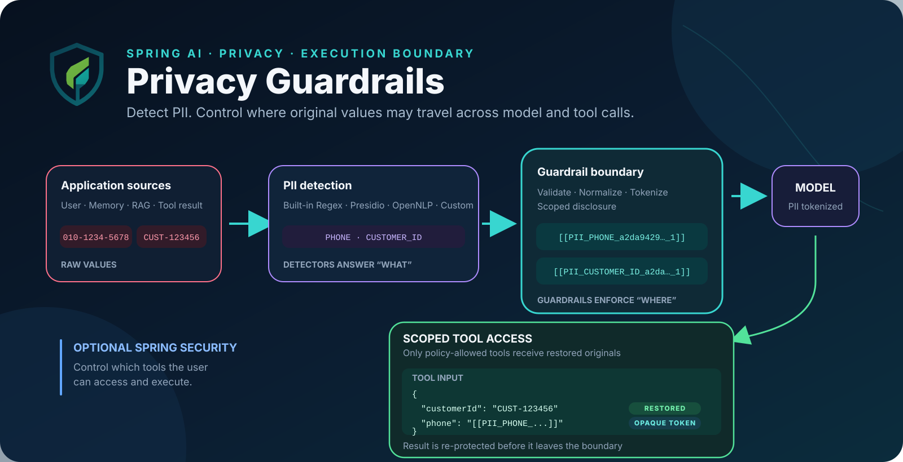
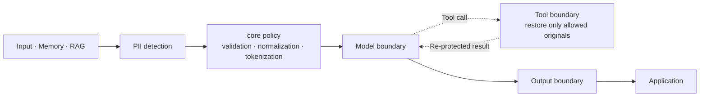
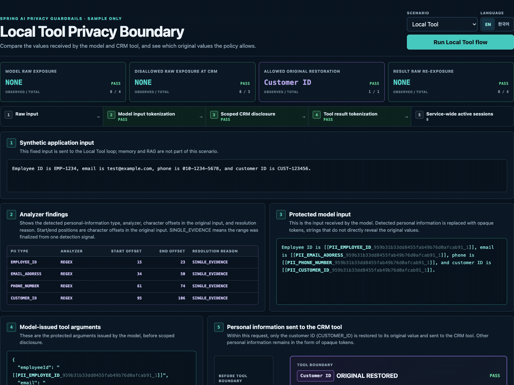
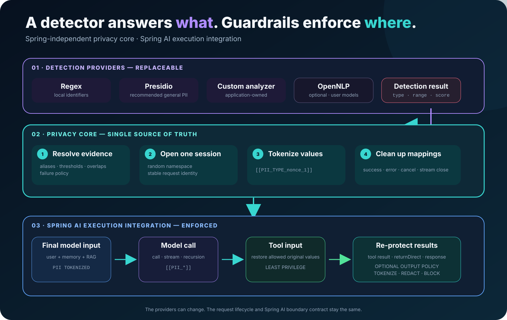

# Spring AI Privacy Guardrails

[English](README.md) | [한국어](README.ko.md) | [Documentation](https://ultramancode.github.io/spring-ai-privacy-guardrails/)

<p align="center">
  
</p>

**Detect PII with built-in and pluggable analyzers. Control where original
values may travel.**

When protection is applied to a `ChatClient`, PII detected by analyzers is
replaced with request-scoped tokens before the input is sent to the model.
Immediately before a protected tool runs, original values are restored only for
the entity types allowed by policy, and the tool result is protected again.
Final-response inspection can be enabled when needed.

Spring AI Privacy Guardrails combines a Spring-independent privacy `core` with
Spring AI integration to enforce privacy policies across chat, RAG, memory,
tool-call, and output boundaries.

## Why It Exists

Detection is the first step. This library turns findings from built-in and
pluggable analyzers into request-scoped policy at the model, tool, and output
boundaries.



## Run the Sample

The sample includes a deterministic local `ChatModel`, so no cloud credentials
are required. With JDK 21 installed, run the following command from the
repository root:

```bash
./gradlew :spring-ai-privacy-guardrails-sample-demo:run
```

Open `http://127.0.0.1:8080` to use the sample's **Privacy Boundary
Inspector**. It shows analyzer findings and the tokenized input sent to the
model. It also demonstrates that the original `CUSTOMER_ID` is restored only
when the permitted tool runs, that the result is protected again, and that the
active session count returns to zero after the call.

<p align="center">
  
</p>

Text not matched by the demo's detection rules may be returned unchanged by the
local model, and the Inspector does not expose token mappings. The
[Sample Guide](samples/spring-ai-demo/README.md) covers optional Presidio and
OpenNLP configurations, MCP round-trip tests, and real-model integration.
The default repository checks do not call remote models.

## Add Protection to an Application

The following example adds privacy boundaries to a Spring AI application that
already provides a `ChatModel` and `ChatClient.Builder`.

### Choose a Starter

Choose the starter that matches the analyzer you plan to use.

| Use case | Starter |
| --- | --- |
| General PII detection with Presidio | `spring-ai-privacy-guardrails-presidio-spring-boot-starter` |
| Regex rules or custom analyzers | `spring-ai-privacy-guardrails-spring-boot-starter` |
| JVM-only environment with compatible OpenNLP models | `spring-ai-privacy-guardrails-opennlp-spring-boot-starter` |

The Presidio starter requires an external Presidio Analyzer service. The
Presidio and OpenNLP starters already include the base Privacy Guardrails
starter, so do not add it separately. Adding a starter dependency alone enables
neither privacy protection nor an analyzer.

### Dependency and Basic Configuration

The examples below use version `0.1.0`. To start without an external analyzer
service, use the base starter with an application-specific regex rule.

```gradle
dependencies {
    implementation "io.github.ultramancode:spring-ai-privacy-guardrails-spring-boot-starter:0.1.0"
}
```

```yaml
spring:
  ai:
    privacy:
      enabled: true
      output:
        enabled: true
        action: tokenize
      regex:
        enabled: true
        rules:
          - entity-type: EMPLOYEE_ID
            pattern: "\\bEMP-\\d{4}\\b"
            score: 0.90
```

The `output` section is optional. When omitted, final-response inspection is
disabled.

This example rule is application-specific and detects only values in the
`EMP-1234` format. It does not establish general PII-detection performance.
Validate analyzers for production using data representative of your
environment.

### Protect a ChatClient

Apply the starter-provided configuration to each `ChatClient.Builder` that you
want to protect.

```java
@Bean
ChatClient privacyChatClient(
        ChatClient.Builder builder,
        PrivacyChatClientConfigurer privacyConfigurer
) {
    return privacyConfigurer.configure(builder).build();
}
```

Only `ChatClient` instances configured with `PrivacyChatClientConfigurer` are
protected. Enabling privacy protection requires at least one analyzer;
otherwise, application startup fails. Direct calls to a `ChatModel` are outside
the automatic protection boundary. See [Configuration](docs/configuration.md)
for derived clients, analyzer combinations, and failure policies.

## Per-Tool Original Disclosure

Registering a tool does not grant access to original PII values. Disclosure is
deny-by-default. Original values are restored immediately before execution only
when the policy lists both the exact, case-sensitive tool name and the required
canonical entity types.

```yaml
spring:
  ai:
    privacy:
      tools:
        disclosures:
          customerLookup:
            - CUSTOMER_ID
```

Wrap tools with `PrivacyToolCallbackFactory` and register them with a protected
`ChatClient`.

```java
@Bean
ToolCallback customerLookup(
        PrivacyToolCallbackFactory toolCallbackFactory,
        CustomerLookupTool delegate
) {
    return toolCallbackFactory.wrap(delegate);
}
```

In the standard tool-execution path of a protected `ChatClient`, unwrapped
callbacks are rejected before execution. Tool results are protected again
before they are returned to the model or application.

For a `ToolCallbackProvider` whose tool list changes at runtime, such as an MCP
provider, use `wrapProvider(...)`. Combine multiple `ToolCallbackProvider`
instances with `wrapProviders(...)`. The application must protect any separate
execution paths that use a custom `ToolCallingManager` or
`ToolCallbackResolver`. See
[Per-Tool Original Disclosure](docs/configuration.md#per-tool-original-disclosure)
for the complete rules.

## Core Protection Behavior

<p align="center">
  
</p>

- Each protected request uses an isolated `PrivacySession`. Detected PII in
  supported model input, including memory and RAG content, is tokenized before
  the model call.
- Protected tools receive only original values allowed by policy. Structured
  tool input remains least-privilege, and tool results are protected again
  before they reach the model or application, including `returnDirect`.
- When enabled, output protection applies `TOKENIZE`, `REDACT`, or `BLOCK` to
  completed responses. Streaming responses are buffered for inspection, and
  managed session mappings are cleared on completion, failure, or cancellation.

See [Configuration](docs/configuration.md) for detailed behavior and
[Architecture](docs/architecture.md) for request flow and module
responsibilities.

## Published Modules

Analyzer-specific starters bring in their runtime modules as transitive
dependencies. Add test support separately in the application's test scope.

| Module | Purpose |
| --- | --- |
| `spring-ai-privacy-guardrails-core` | Analyzer SPI, detection resolution, sessions, regex analysis, and tokenization |
| `spring-ai-privacy-guardrails-spring-ai` | Advisors and per-tool original-disclosure boundaries |
| `spring-ai-privacy-guardrails-presidio` | Presidio Analyzer HTTP adapter |
| `spring-ai-privacy-guardrails-opennlp` | JVM-only adapter for user-supplied OpenNLP models |
| `spring-ai-privacy-guardrails-test` | Optional model and tool probes with AssertJ assertions |

See [Architecture](docs/architecture.md) for module responsibilities and the
dependency structure. The repository-only JMH benchmark module is not
published as a library. Its workloads and execution instructions are described
in [Evaluation](docs/evaluation.md#jmh-benchmarks).

## Compatibility and Status

| Component | Verified version |
| --- | --- |
| Java baseline | 21 |
| Java compatibility CI | 25 |
| Spring AI | 2.0.0 |
| Spring Boot | 4.1.0 |
| Gradle wrapper | 9.6.1 |

CI runs the default verification on Java 21 and 25. On Java 21, it separately
runs live integration tests against a Presidio service and the JMH smoke tests.

## Documentation

- [Configuration](docs/configuration.md): starters, analyzers, tool policies,
  and output policies
- [Architecture](docs/architecture.md): modules and model, tool, and session
  execution flow
- [Threat Model](docs/threat-model.md): protected assets, trust boundaries,
  controls, limitations, and separately managed areas
- [Evaluation and Benchmarks](docs/evaluation.md): verification coverage and
  interpretation limits
- [Sample Guide](samples/spring-ai-demo/README.md): API, MCP, and real-model
  integration examples

## Security Boundary

This library reduces the risk of accidental PII disclosure on supported Spring
AI execution paths, but it is not a complete DLP system or a guarantee of legal
compliance.

The library does not manage application authentication or authorization,
logging policies, data-retention policies, or access controls for stored
`ChatMemory`, vector stores, and databases. Analyzer quality must also be
validated and tuned for the production environment. Aside from explicitly
supported reasoning text, the library does not automatically protect response
metadata or non-text media. Apply authentication and transport encryption to
remote analyzers.

Before using the library in production, review [Security](SECURITY.md) and the
[Threat Model](docs/threat-model.md).

## Build and Verify

```bash
./gradlew --no-daemon clean check
```

This command runs the repository's tests and verifies its modules and
documentation. See [Evaluation](docs/evaluation.md) for the demo analyzer
regression test and JMH benchmarks.

## Contributing

See [Contributing](CONTRIBUTING.md). All contributions are provided under the
Apache License 2.0.
