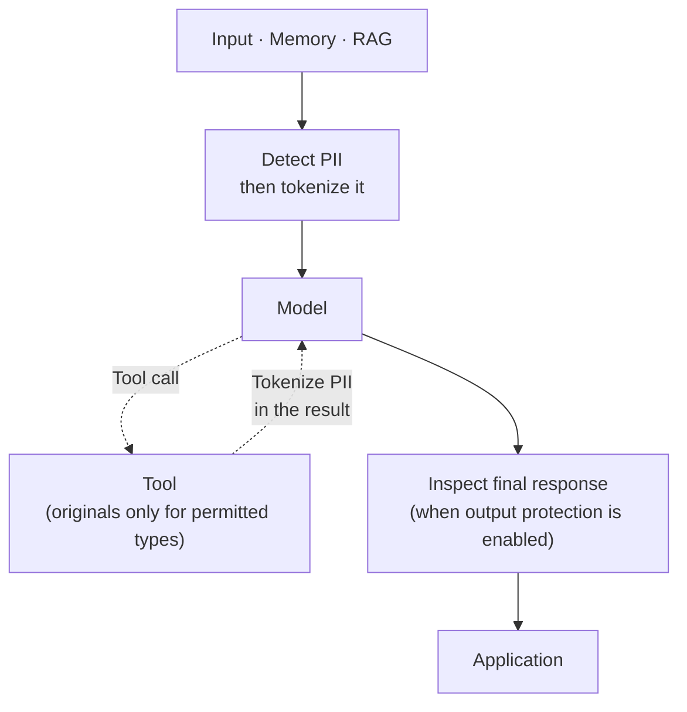
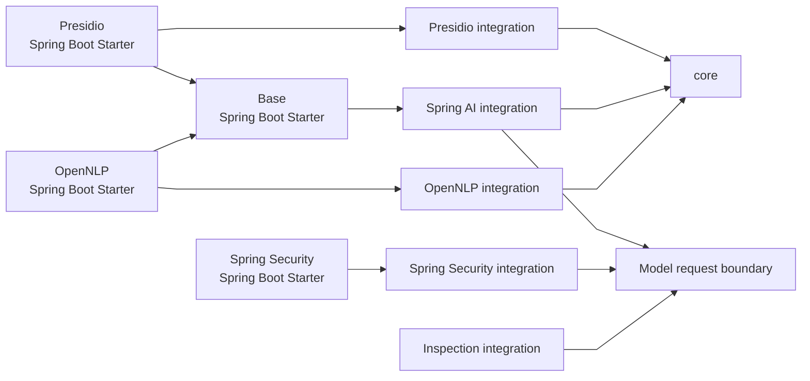
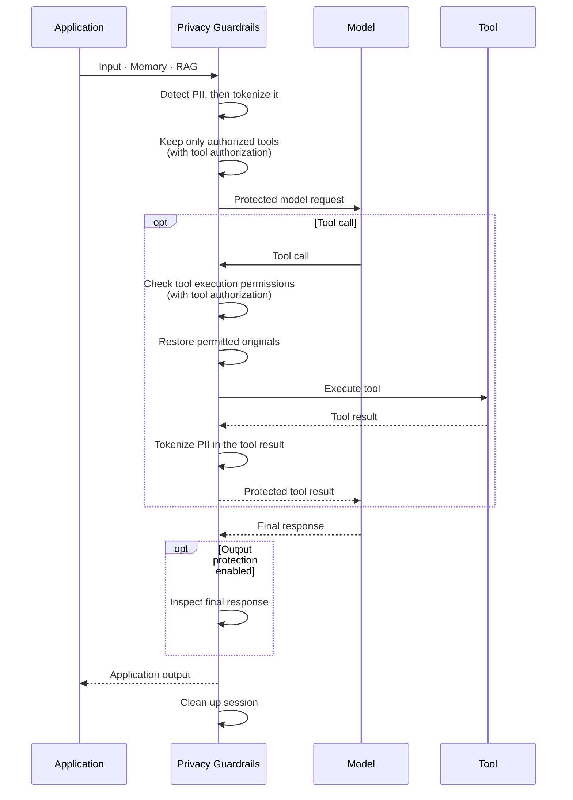
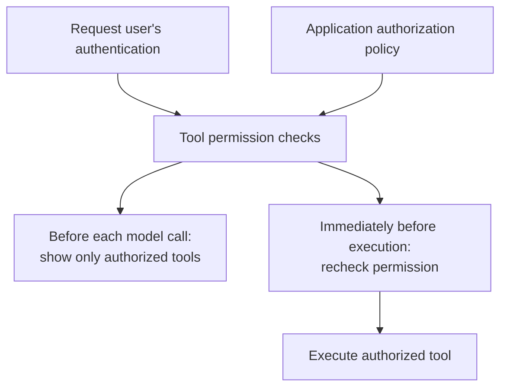

# Architecture

**English** | [한국어](ko/architecture.md)

## Responsibility Boundary

Spring AI Privacy Guardrails tokenizes PII detected by analyzers before sending
data to a model, replacing it with request-scoped **opaque tokens**. These replacement
strings do not directly reveal the original values. Immediately before tool
execution, it restores only the original values allowed by policy and
re-protects the results afterward. When output protection is enabled, it also
applies the configured policy to the final response.

Detection offsets always refer to the caller-supplied input text. Analyzers
return ranges, entity types, scores, and other evidence; `core` validates,
canonicalizes, and resolves that evidence according to application policy.
Mappings between opaque tokens and original values are managed per request
through `PrivacySession`.

The library protects data that crosses supported model, tool, and output
boundaries. The optional Spring Security integration can also authorize tool
discovery and execution.

## Module Structure

This project is a Gradle multi-module library that separates core privacy
policy, Spring AI integration, and analyzer integrations.

The diagram shows the main dependencies between this library's modules. Arrows
point to the required module. Privacy protection and tool authorization can be
used independently or applied together to the same `ChatClient`.

The `core` module has no Spring dependency and provides detection resolution,
PII tokenization, session management, and the built-in Regex analyzer. The Presidio
and OpenNLP integration modules add the corresponding analyzer integrations on
top of these shared capabilities.

The Spring AI integration module connects `core` to `ChatClient`, model calls,
and tool execution boundaries. The base Spring Boot starter assembles `core`
with the Spring AI integration, while analyzer-specific Spring Boot starters
add the corresponding analyzer integration.

The optional Spring Security integration uses Spring AI's tool-calling APIs and
Spring Security Core. Its Spring Boot starter can be used independently of the
base starter.

To use privacy protection and tool authorization together, add a privacy
starter alongside the Spring Security starter and apply both capabilities to
the same `ChatClient`. No Spring Security dependency is added to `core` or any
existing privacy module.

The `spring-ai-boundary` module combines the features applied immediately before
a model call and depends only on Spring AI. For each client, enabled features run
in a fixed order: privacy, tool definition authorization, then content inspection.
Feature modules use this shared module and can be used independently of each other.

The test-support module provides test-only APIs for verifying privacy behavior.
Benchmarks and samples are repository-internal modules for performance
measurement and runnable examples and are not published artifacts.

## Library APIs and Extension Points

The library provides APIs used directly by applications and extension points
for custom implementations. Internal implementation types are not public API
and are not part of the compatibility contract.

| Role | Representative public APIs |
| --- | --- |
| Application API | `PrivacyService`, `PrivacySession` |
| Analyzer extension | `PiiAnalyzer`, `RegexPiiMatchValidator` |
| Tool policy | `ToolDisclosurePolicy`, `PrivacyToolCallbackFactory` |
| Spring AI integration | `PrivacyChatClientConfigurer` |
| Spring Security integration | `ToolAuthorizationContext`, `SpringSecurityToolBoundary`, `ToolAuthorizationChatClientFactory`, `PrivacySecurityChatClientFactory` |
| Test support | `PrivacyTestProbe`, `PrivacyTestAssertions`, `PrivacyTestProbeAssert` |

This table shows representative APIs only. See the Javadoc for the complete
public API.

## Detection and Resolution

Each `PiiAnalyzer` has a unique provider ID and returns detected source ranges
as `PiiSpan` values. The `core` module applies entity aliases, score thresholds,
the detection allowlist, and overlap-resolution rules before deciding which
ranges to protect.

Entity labels returned by analyzers are not trusted as-is. Core validates
entity-label syntax and reported span ranges, then applies aliases and trusted
entity types. Labels that are neither built in nor explicitly trusted are
handled as the generic `PII` entity type.

When an application supplies `PiiSpan` values directly without running an
analyzer, the same `core` rules for range validation, entity normalization, and
overlap resolution still apply. Detection results retain input-text offsets and
provenance rather than copying PII substrings from the input text.

The provided Regex, Presidio, and OpenNLP analyzers are implemented for safe
reuse across concurrent requests. Presidio request timeouts and retries are
managed through library configuration.

A custom `PiiAnalyzer` or `RegexPiiMatchValidator` may be invoked concurrently
by multiple requests and must therefore be thread-safe. If it adds blocking
work such as an external service call, that work must also use an appropriate
finite timeout.

Analyzer selection, failure policy, and score thresholds are configured under
[Detection and Resolution](configuration.md#detection-and-resolution), which
also documents overlap-resolution behavior.

## Requests and Sessions

Mappings between opaque tokens and original values are managed per request
through `PrivacySession`.
Direct `core` usage and Spring AI integration use the same session model.

Each request receives a separate session, and opaque tokens created in that session are
valid only within that request. The Spring AI execution context carries only a
session handle. The actual mapping between opaque tokens and original values
remains in library-managed internal state and is not included in model requests
or tool inputs.

A session is not bound to a specific execution thread, so tool execution can
continue on another thread while using the same request session. If the session
is missing or already closed, privacy processing fails instead of continuing.

With Spring AI integration, the library automatically cleans up the session
mapping when a request completes, fails, or its stream is cancelled. When
using the `core` module's `PrivacyService` directly, the application manages
the session lifecycle explicitly.

## Spring AI Execution Flow

The Spring AI integration protects the supported model and tool flow within one
request session. When this library's Spring Security integration is applied to
the client, it also checks which tools can be shown to the model and whether
the requested tools may execute.

Tool authorization uses the authentication of the user who started the request.
The tool list is authorized before every model call. All requested tools are
authorized before any of them execute, and each tool is checked again immediately
before it runs. If execution authorization is denied for a tool, its original
values are not restored and the tool is not executed. See
[Tool Authorization](security.md) for authentication propagation and policy
configuration.

`PrivacyChatClientConfigurer` applies the privacy configuration only to the
`ChatClient.Builder` selected by the application and does not affect other
`ChatClient` instances. A builder derived from an already protected client
retains that privacy configuration and should not have
`PrivacyChatClientConfigurer` applied again.

If a privacy boundary cannot resolve its required session, or if the privacy
configuration is duplicated, execution fails closed rather than continuing
with incomplete protection.

The privacy integration can be used with other Spring AI advisors. Changes to
model input, tools, or responses made by an advisor outside the privacy
boundary are outside the automatic protection scope. See
[Apply Privacy Protection to ChatClient](configuration.md#apply-privacy-protection-to-chatclient)
for the supported composition rules.

## Model and Output

Text in supported model-bound inputs is protected before the model provider is
invoked. This includes the initial user input as well as supported message and
tool-related text that is later sent to the model.

Supported `Message` implementations preserve the fields required by their
contracts while applying privacy protection. Unsupported `Message`
implementations fail rather than allowing unprotected data to reach the model.

When output protection is enabled, the configured policy is applied to each
complete response before it is returned to the application. When a complete
response must be inspected, streaming output is buffered until completion so
sensitive values split across multiple stream chunks can be inspected as one
response.

Apart from reasoning text explicitly supported by the library, response metadata
and non-text content such as images and audio are not automatically protected.

Output policy and streaming behavior are documented under
[Output Policy and Streaming](configuration.md#output-policy-and-streaming).

## Tool Execution

`PrivacyToolCallbackFactory` is the public API for applying privacy protection
to `ToolCallback` and `ToolCallbackProvider` instances. Protected tools use the
current request session to restore only the original values they need and
protect their results again after execution.

Original-value disclosure to tools is default-deny. Tool registration and
permission to receive original values are separate concerns: only tools
configured for specific entity types receive those originals immediately before
execution.

Tool information sent to the model, including the tool name, description, and
JSON schema, is also inspected for PII. Tool input is protected before
execution, only the required values are selectively restored, and tool results
are inspected and protected again before returning to the model or application.

On a protected `ChatClient`'s standard tool path, callbacks that are not wrapped
by `PrivacyToolCallbackFactory` are rejected. Separate execution paths that use
a custom `ToolCallingManager` or `ToolCallbackResolver` are outside the automatic
protection scope.

Logs written or exceptions raised inside a tool after original values have been
disclosed are not re-protected and may contain those values.

Detailed disclosure rules and the `returnDirect` flow are documented under
[Per-Tool Original Disclosure](configuration.md#per-tool-original-disclosure).

## Optional Tool Authorization Boundary

The Spring Security integration shows the model only tools the current user is
allowed to use, then checks permission again immediately before each tool runs.
Authorization checks use the user's `Authentication` obtained at the start of
the request. Tool authorization can be used on its own or with privacy
protection.

When tool authorization and privacy protection are used together, tool
permission is checked before restoring the original PII values allowed for
that tool.

The Spring Boot starter provides factories for creating clients with tool
authorization. A factory applies authorization to the `ChatClient` it creates.
The configuration of other clients, including those using the same model,
is unaffected.

See [Spring Security Tool Authorization](security.md) for authorization
policies, custom tool execution, and authentication in asynchronous calls.

## Errors and Diagnostics

Library-owned privacy failures use `PrivacyGuardrailException` and
`PrivacyFailureCode`. These failures do not include original PII or analyzer
response bodies; they expose only limited diagnostic information such as the
failure category and processing phase.

`PiiAnalyzerFailureObserver` receives the same sanitized failure information.
It cannot change the analysis result, and the information can be used for
operational diagnostics such as metrics, tracing, and logs.

The optional `PrivacyEnforcementObserver` reports `PROTECTED`, `DISCLOSED`, and
`BLOCKED` outcomes at the model, tool-input, tool-result, and application-output
boundaries. Events contain only `boundary` and `outcome`; observer failures
cannot affect privacy enforcement.

Exceptions raised by model providers, application tools, and external
libraries may propagate using their original exception types. Exceptions and
logs created outside the library are outside this sanitization boundary, and
whether they record sensitive values depends on the logging configuration of
the component that produced them.

Error codes and processing phases are documented under
[Privacy Error Handling](configuration.md#privacy-error-handling).

## Resource Limits and Request Cleanup

Privacy operations performed directly by the library, such as text
transformation, structured-value traversal, analyzer-result retention, and
response inspection, use processing bounds to keep memory use predictable. See
[Configuration](configuration.md) for the main limits and related settings.

When a Spring AI streaming request is cancelled or fails, the library cleans
up the request session and the privacy mappings it manages.

Request cancellation cleans up the session but cannot forcibly stop synchronous
analyzer or tool code that is already running. Such implementations need their
own timeouts and cancellation handling.

These resource limits apply to privacy inspection and transformation. Execution
policies such as model and tool call counts, cost, and concurrency continue to
follow the application's or orchestration framework's existing settings.

## Test Support

The `spring-ai-privacy-guardrails-test` module provides test utilities that can
record requests sent to the model and inputs passed to tool execution. With a
local `ChatModel` test double, they can verify without calling a remote model
that PII did not reach the model, only required original values were disclosed
to a tool, and the request session was cleaned up correctly.

`PrivacyTestProbe` is a test-only API for verifying privacy-boundary behavior.
See [Test Support](configuration.md#test-support) for usage.

## Analyzer Integration

Analyzer integration modules such as Presidio and OpenNLP translate analyzer
detections into the common `PiiAnalyzer` contract. Regardless of which analyzer
is used, downstream detection resolution and per-tool original disclosure
continue to follow the shared `core` rules.

For a remote analyzer service such as Presidio, connection security,
credentials, and deployment environment follow that service's configuration.
When the application supplies a model, as with OpenNLP, the selected model can
affect both detection coverage and quality.

Available analyzer configurations are documented under
[Starter Selection](configuration.md#starter-selection).

## Stored Data

`ChatMemory` content and RAG results are protected when supported text from them
is included in model or tool input. The library does not automatically rewrite
data that is already stored.

See [Stored Data and Diagnostics](configuration.md#stored-data-and-diagnostics)
for the detailed scope.
