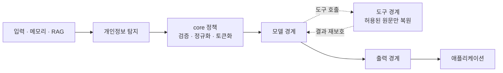
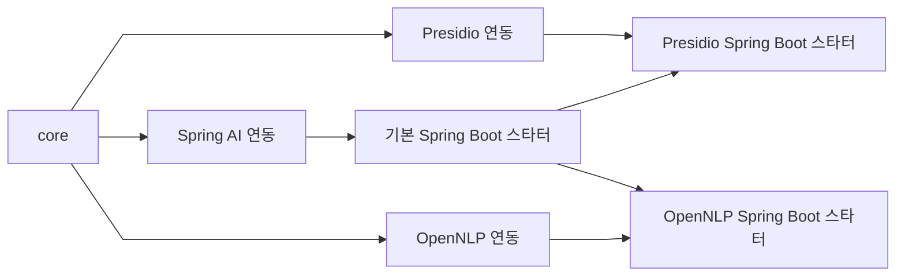
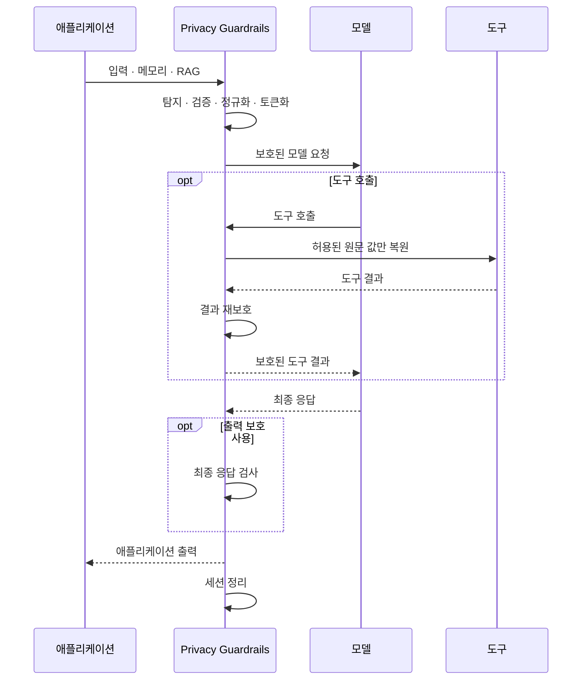

# 아키텍처

[English](../architecture.md) | [한국어](architecture.md)

<!-- i18n-source: docs/architecture.md -->
<!-- i18n-source-sha256: 7cefceefe2799e4e372c7491b3d8b0b4dd699a96976763283f834a092ab00c11 -->

## 책임 범위

Spring AI Privacy Guardrails는 분석기가 탐지한 개인정보를 요청 단위 토큰으로 바꾸어
모델에 전달합니다. 도구를 실행하기 직전에 정책이 허용한 원문 값만 복원하고, 실행 결과를
다시 보호합니다. 출력 보호를 활성화하면 최종 응답에도 설정한 정책을 적용합니다.

탐지 위치는 항상 호출자가 제공한 입력 원문을 기준으로 계산합니다. 분석기는 탐지 범위와
유형, 신뢰도 등의 근거를 반환하며, `core` 모듈은 이를 검증하고 정규화한 뒤
애플리케이션 정책에 따라 해석합니다. 토큰과 원본 값의 매핑은 요청별
`PrivacySession`을 통해 관리됩니다.

라이브러리는 지원하는 모델·도구·출력 경계를 통과하는 데이터를 보호합니다.
애플리케이션 내부에서 별도로 처리하는 데이터와 사용자 접근 권한은 자동 보호 범위에
포함되지 않습니다.

## 모듈 구조

이 프로젝트는 Gradle 멀티 모듈 라이브러리이며, 모듈별로 개인정보 보호 정책,
Spring AI 연동과 분석기 연동의 역할을 분리합니다.

아래 화살표는 각 모듈이 조합되어 Spring Boot 스타터를 구성하는 흐름을 나타냅니다.

`core` 모듈은 Spring에 의존하지 않고 탐지 결과 해석, 토큰화, 세션 관리와 내장
정규식(Regex) 분석기를 제공합니다. Presidio와 OpenNLP 연동 모듈은 이 공통 기능 위에 각
분석기와의 연동을 추가합니다.

Spring AI 연동 모듈은 `core`를 `ChatClient`, 모델 호출과 도구 실행 경계에 연결합니다.
기본 Spring Boot 스타터는 `core`와 Spring AI 연동을 조립하고, 분석기별 Spring Boot
스타터는 여기에 해당 분석기 연동을 추가합니다.

테스트 지원 모듈은 애플리케이션에서 개인정보 보호 동작을 검증하기 위한 테스트 전용
API를 제공합니다. 벤치마크와 샘플은 각각 성능 측정과 실행 가능한 사용 예제를 위한
저장소 내부 모듈이며 배포 산출물에는 포함되지 않습니다.

## 라이브러리 API와 확장 지점

애플리케이션에서 직접 사용하는 API와 사용자 정의 구현을 위한 확장 지점을 제공합니다.
라이브러리 내부 구현은 공개 API가 아니며 호환성 계약에 포함되지 않습니다.

| 역할 | 대표 공개 API |
| --- | --- |
| 애플리케이션 API | `PrivacyService`, `PrivacySession` |
| 분석기 확장 | `PiiAnalyzer`, `RegexPiiMatchValidator` |
| 도구 정책 | `ToolDisclosurePolicy`, `PrivacyToolCallbackFactory` |
| Spring AI 연동 | `PrivacyChatClientConfigurer` |
| 테스트 지원 | `PrivacyTestProbe`, `PrivacyTestAssertions`, `PrivacyTestProbeAssert` |

이 표는 각 역할의 대표 API만 보여주며 전체 공개 API 목록은 Javadoc에서 확인할 수 있습니다.

## 탐지와 해석

각 `PiiAnalyzer`는 고유한 분석기 ID(provider ID)를 가지며 입력 원문에서 탐지한 범위를
`PiiSpan`으로 반환합니다. `core` 모듈은 이 결과에 엔티티 별칭, 신뢰도 하한, 탐지 허용
목록과 중첩 범위 해석 규칙을 적용한 뒤 실제 보호에 사용할 범위를 결정합니다.

분석기가 반환한 엔티티 레이블은 그대로 신뢰하지 않습니다. 형식과 범위를 검증하고,
별칭과 신뢰 유형을 적용합니다. 기본 또는 명시적으로 신뢰된 유형이 아닌 레이블은
범용 개인정보 유형인 `PII`로 처리합니다.

분석기를 거치지 않고 애플리케이션이 `PiiSpan`을 직접 제공하는 경우에도 범위 검증,
엔티티 정규화와 중첩 처리 같은 `core`의 공통 규칙은 동일하게 적용됩니다. 탐지 결과는
입력 원문의 개인정보를 별도로 복사하기보다 입력 원문에서의 위치와 탐지 출처를
유지합니다.

기본으로 제공하는 정규식, Presidio와 OpenNLP 분석기는 여러 요청에서 공유해 사용할 수
있도록 구현되어 있습니다. Presidio의 외부 서비스 호출 제한 시간과 재시도는 라이브러리
설정으로 관리합니다.

애플리케이션이 `PiiAnalyzer`나 `RegexPiiMatchValidator`를 직접 구현하는 경우에는 여러
요청에서 동시에 호출될 수 있으므로 동시 호출에 안전해야 합니다. 외부 서비스 호출처럼
대기 시간이 발생하는 작업을 추가한다면 적절한 제한 시간도 직접 두어야 합니다.

분석기 선택·실패 정책·신뢰도 하한의 설정과 중첩 범위 처리 방식은
[탐지와 해석](configuration.md#탐지와-해석)에서 확인할 수 있습니다.

## 요청과 세션

토큰과 원본 값의 매핑은 요청별 `PrivacySession`을 통해 관리됩니다. `core`를 직접
사용할 때와 Spring AI 연동을 사용할 때 모두 같은 세션 모델을 사용합니다.

각 요청에는 별도의 세션이 만들어지고, 생성된 토큰은 해당 요청 안에서만 유효합니다.
Spring AI 실행 컨텍스트에는 세션 식별자(`handle`)만 전달하며, 실제 토큰과 원본 값의
매핑은 라이브러리가 관리하는 내부 상태에 유지됩니다. 이 매핑은 모델 요청이나 도구
입력에 포함되지 않습니다.

세션은 특정 실행 스레드에 종속되지 않으므로 도구 실행 스레드가 바뀌어도 같은 요청의
세션을 이어서 사용할 수 있습니다. 세션을 찾을 수 없거나 이미 종료된 경우에는
개인정보 처리를 계속하지 않고 오류로 처리합니다.

Spring AI 연동에서는 요청이 정상적으로 끝나거나 오류 또는 스트림 취소가 발생하면
라이브러리가 세션 매핑을 자동으로 정리합니다. `core` 모듈의 `PrivacyService`를 직접
사용하는 경우에는 애플리케이션이 세션의 수명주기를 관리합니다.

## Spring AI 실행 흐름

Spring AI 연동은 지원하는 모델과 도구 호출 흐름을 하나의 요청 세션 안에서 보호합니다.

`PrivacyChatClientConfigurer`는 애플리케이션이 선택한 `ChatClient.Builder`에만
개인정보 보호 구성을 적용하며, 다른 `ChatClient`에는 영향을 주지 않습니다.
보호된 클라이언트에서 파생한 빌더는 기존 보호 구성을 유지하므로
`PrivacyChatClientConfigurer`를 다시 적용하지 않아야 합니다.

보호 경계에서 필요한 세션을 확인할 수 없거나 개인정보 보호 구성이 중복된 경우에는
보호가 불완전한 상태로 실행을 계속하지 않고 오류로 처리합니다.

다른 Spring AI Advisor와 함께 사용할 수도 있습니다. 다만 개인정보 보호 경계
밖에서 모델 입력, 도구 또는 응답을 변경하는 Advisor의 변경 내용은 자동 보호 범위에
포함되지 않습니다. 권장 구성 방법은
[ChatClient에 보호 적용](configuration.md#chatclient에-보호-적용)을 참고하세요.

## 모델과 출력

지원하는 모델 입력에 포함된 텍스트는 모델 제공자를 호출하기 전에 보호합니다.
초기 사용자 입력뿐 아니라 지원되는 메시지와 도구 관련 텍스트도 모델에 전달되기 전에
검사합니다.

라이브러리가 지원하는 `Message` 구현은 필요한 필드를 유지하면서 개인정보를
보호합니다. 지원하지 않는 `Message` 구현은 보호되지 않은 데이터가 모델에 전달되지
않도록 오류로 처리합니다.

출력 보호를 활성화하면 완성된 응답마다 애플리케이션에 반환하기 전에 설정한 출력 정책을
적용합니다. 전체 응답을 검사해야 하는 경우에는 여러 스트리밍 조각에 나뉜 개인정보도
하나의 응답으로 검사할 수 있도록 완료 시점까지 버퍼링합니다.

라이브러리가 명시적으로 지원하는 추론 텍스트 외의 응답 메타데이터와 이미지·오디오
같은 비텍스트 콘텐츠는 자동으로 보호하지 않습니다.

출력 정책과 스트리밍 동작은
[출력 정책과 스트리밍](configuration.md#출력-정책과-스트리밍)을 참고하세요.

## 도구 실행

`PrivacyToolCallbackFactory`는 `ToolCallback`과 `ToolCallbackProvider`에 개인정보
보호를 적용하는 공개 API입니다. 보호된 도구는 현재 요청 세션을 사용해 필요한
원문 값만 복원하고, 실행 결과를 다시 보호합니다.

도구에 대한 원문 값 공개는 기본적으로 허용되지 않습니다. 도구 등록과 원문 값 공개
권한은 별개이며, 공개할 엔티티 유형을 명시한 도구에만 실행 직전에 해당 원문 값을
복원합니다.

도구 이름, 설명과 JSON 스키마처럼 모델에 전달되는 도구 정보도 개인정보를
검사합니다. 도구 입력은 실행 전에 보호하고 필요한 값만 선택적으로 복원하며,
도구 실행 결과는 다시 검사하고 보호한 뒤 모델이나 애플리케이션으로 전달합니다.

보호된 `ChatClient`의 표준 도구 경로에서는 `PrivacyToolCallbackFactory`로 감싸지 않은
콜백을 오류로 처리합니다. 사용자 정의 `ToolCallingManager`나 `ToolCallbackResolver`를
사용하는 별도 실행 경로는 자동 보호 범위에 포함되지 않습니다.

원문 값이 공개된 뒤 도구 내부에서 남긴 로그나 발생한 예외는 재보호 대상이 아니므로
공개된 값을 포함할 수 있습니다.

자세한 원문 공개 규칙과 `returnDirect` 흐름은
[도구별 원문 공개](configuration.md#도구별-원문-공개)를 참고하세요.

## 오류와 진단

라이브러리가 직접 발생시키는 개인정보 보호 오류는 `PrivacyGuardrailException`과
`PrivacyFailureCode`로 구분됩니다. 이러한 오류에는 원문의 개인정보나 분석기 응답
본문을 포함하지 않고, 실패 유형과 처리 단계처럼 진단에 필요한 정보만 제공합니다.

`PiiAnalyzerFailureObserver`도 같은 방식으로 정리된 실패 정보만 전달받습니다.
이 정보는 분석 결과를 변경하지 않으며, 메트릭, 추적과 로그 같은 운영 진단에
활용할 수 있습니다.

선택적으로 등록할 수 있는 `PrivacyEnforcementObserver`는 모델, 도구 입력, 도구 결과,
애플리케이션 출력 경계에서 발생한 `PROTECTED`, `DISCLOSED`, `BLOCKED` 결과를
전달합니다. 이벤트에는 `boundary`와 `outcome`만 포함되며, 옵저버에서 오류가
발생해도 개인정보 보호 처리에는 영향을 주지 않습니다.

모델 제공자, 애플리케이션 도구와 외부 라이브러리에서 발생한 예외는 원래 예외
유형으로 전달될 수 있습니다. 라이브러리 외부에서 생성된 예외와 로그는 이 정제
범위에 포함되지 않으며, 민감한 값의 기록 여부는 해당 구성 요소의 로깅 설정에 따릅니다.

오류 코드와 처리 단계는
[개인정보 보호 오류 처리](configuration.md#개인정보-보호-오류-처리)를 참고하세요.

## 자원 제한과 요청 정리

텍스트 변환, 구조화된 값 탐색, 분석 결과 보존과 응답 검사처럼 라이브러리가 직접
수행하는 개인정보 보호 작업에는 메모리 사용을 예측할 수 있도록 처리 상한이 적용됩니다.
주요 제한과 관련 설정은 [설정 문서](configuration.md)를 참고하세요.

Spring AI 스트리밍 요청이 취소되거나 오류가 발생하면 라이브러리는 해당 요청의
세션과 관리 중인 개인정보 매핑을 정리합니다.

요청 취소는 세션을 정리하지만 이미 실행 중인 동기식 분석기나 도구 코드를 강제로
중단하지는 않습니다. 이러한 구현에는 자체 제한 시간과 취소 처리가 필요합니다.

이 라이브러리의 자원 제한은 개인정보를 검사하고 변환하는 과정에 적용됩니다.
모델과 도구의 호출 횟수, 비용이나 동시 실행 수 같은 실행 정책은 기존 애플리케이션
또는 오케스트레이션 설정을 따릅니다.

## 테스트 지원

`spring-ai-privacy-guardrails-test` 모듈은 모델로 전달된 요청과 도구 실행에 전달된
입력을 기록할 수 있는 테스트 도구를 제공합니다. 로컬 테스트 대역으로 준비한
`ChatModel`과 함께 사용하면 원격 모델을 호출하지 않고도 개인정보가 모델에 전달되지
않았는지, 특정 도구에 필요한 원문 값만 공개됐는지, 요청 세션이 정상적으로 정리됐는지
검증할 수 있습니다.

`PrivacyTestProbe`는 개인정보 보호 경계의 동작을 검증하기 위한 테스트 전용 API이며,
자세한 사용 방법은 [테스트 지원](configuration.md#테스트-지원)을 참고하세요.

## 분석기 연동 방식

Presidio와 OpenNLP 같은 분석기 연동 모듈은 각 분석기의 탐지 결과를 공통
`PiiAnalyzer` 계약에 맞게 변환합니다. 어떤 분석기를 사용하더라도 이후의 탐지 결과
해석과 도구별 원문 공개 정책은 `core`의 공통 규칙을 따릅니다.

Presidio처럼 원격 분석 서비스를 사용하는 경우 연결 보안, 인증 정보와 배포 환경은
해당 서비스의 구성에 따릅니다. OpenNLP처럼 애플리케이션이 모델을 제공하는 방식에서는
사용할 모델에 따라 탐지 대상과 품질이 달라질 수 있습니다.

사용 가능한 분석기 구성은
[스타터 선택](configuration.md#스타터-선택)을 참고하세요.

## 저장 데이터

`ChatMemory`와 RAG 검색 결과는 지원되는 텍스트 형태로 모델이나 도구 입력에 포함될 때
보호됩니다. 저장소에 이미 기록된 데이터 자체는 자동으로 변경하지 않습니다.

자세한 범위는
[저장 데이터와 진단 정보](configuration.md#저장-데이터와-진단-정보)를 참고하세요.
