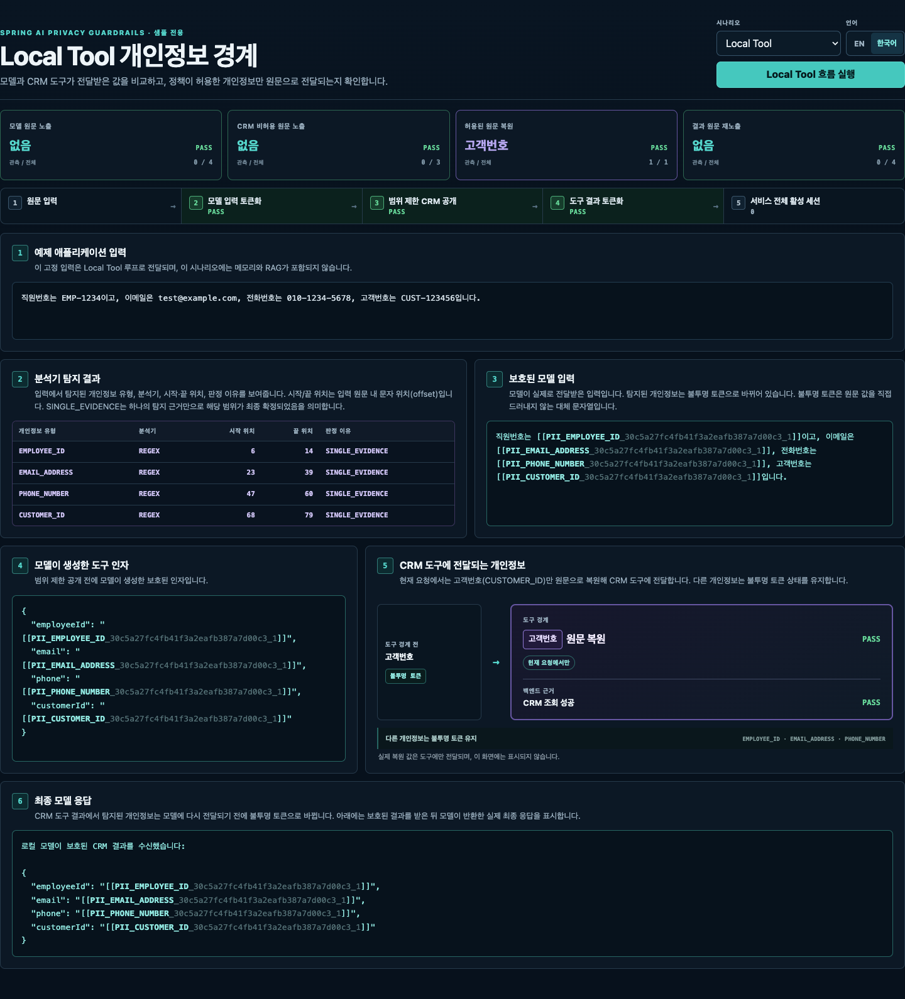
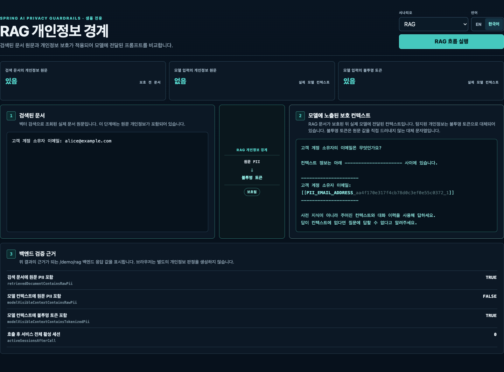
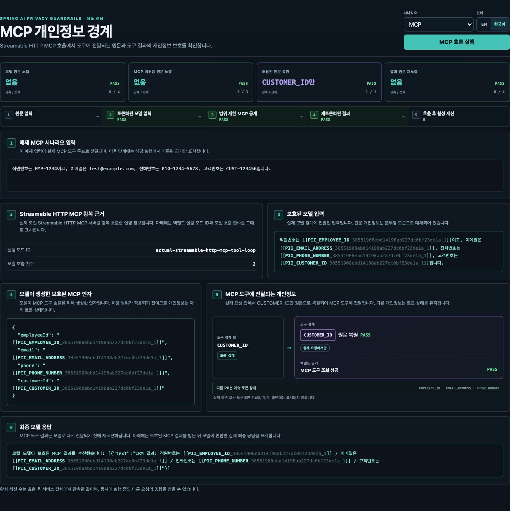

# 샘플 / 데모 가이드

[English](../sample.md) | [한국어](sample.md)

<!-- i18n-source: docs/sample.md -->
<!-- i18n-source-sha256: c5f493d88183ccf1321a85ba8c5bde4fe21fa59bbcc9c87228d234c30f0a37e7 -->

실행 가능한 샘플은 항상 같은 결과를 반환하는 로컬 `ChatModel`, 메모리 내 RAG 구성 요소,
루프백 MCP 서버를 사용하므로 클라우드 자격 증명이 필요하지 않습니다. **Privacy
Boundary Inspector**는 샘플 백엔드가 반환한 런타임 근거를 표시하며, 토큰 매핑을
노출하거나 브라우저에서 개인정보를 별도로 탐지하지 않습니다. RAG 경계 상태는 샘플
백엔드가 반환한 근거만으로 계산해 표시합니다.

## Inspector 실행

JDK 21이 설치된 환경에서 저장소 루트의 다음 명령을 실행합니다.

```bash
./gradlew :spring-ai-privacy-guardrails-sample-demo:run
```

`http://127.0.0.1:8080`을 엽니다. 샘플은 이 루프백 주소에만 바인딩됩니다.
`Local Tool | RAG | MCP` 선택기로 시나리오를 실행하고, `EN | 한국어`로 선택한 런타임
로케일에서 시나리오를 다시 실행할 수 있습니다.

<div style="position: relative; width: 100%; aspect-ratio: 16 / 9;">
  <iframe
    src="https://www.youtube-nocookie.com/embed/vir-x78e9j8"
    title="Spring AI Privacy Guardrails 한국어 데모"
    style="position: absolute; inset: 0; width: 100%; height: 100%; border: 0;"
    loading="lazy"
    referrerpolicy="strict-origin-when-cross-origin"
    allow="accelerometer; autoplay; clipboard-write; encrypted-media; gyroscope; picture-in-picture; web-share"
    allowfullscreen>
  </iframe>
</div>

## 런타임 엔드포인트

| 엔드포인트 | 반환 내용 |
| --- | --- |
| `GET /demo/protect` | EN 또는 KO 고정 예제 데이터의 분석기 탐지 범위와 토큰화 결과. 모델 호출이 아니라 토큰화 미리보기입니다. |
| `POST /demo/protect` | 비어 있지 않은 JSON `text` 필드에 대한 같은 미리보기 |
| `GET /demo/tool-loop` | 프로세스 내부 CRM 구현체를 사용하는 실제 보호된 `ChatClient` 도구 루프의 근거 |
| `GET /demo/rag` | 검색된 원문 문서와 로컬 모델에 실제로 기록된 전체 보호 프롬프트 |
| `GET /demo/mcp-tool-loop` | 실제 로컬 Streamable HTTP MCP 도구 루프의 근거 |

Inspector는 언어별 고정 입력을 가져오기 위해 `GET /demo/scenario`도 사용합니다. 요청과
응답 예제, 선택적 분석기 프로필, 선택형 실제 모델 검증은
[전체 샘플 가이드](https://github.com/ultramancode/spring-ai-privacy-guardrails/blob/main/samples/spring-ai-demo/README.ko.md)를
참고하세요.

## 각 시나리오의 검증 범위

### Local Tool

Inspector는 `/demo/scenario`, `/demo/protect`, `/demo/tool-loop`의 결과를 함께 표시합니다.
예제 데이터에 대해 도구 루프 응답은 탐지된 원문 값 네 개가 모델 경계에서 모두
관찰되지 않고 불투명 토큰이 존재함을 기록합니다. 모델은 토큰화된 `employeeId`, `email`,
`phone`, `customerId` 인자를 생성합니다. 해당 요청 안에서 정책은 허용된
`CUSTOMER_ID`만 복원하고, 나머지 세 값은 프로세스 내부 CRM 구현체 실행 시에도 토큰
상태를 유지합니다. CRM 결과는 두 번째 모델 호출 전에 다시 토큰화됩니다.

반환되는 `boundaryEvidence`의 각 항목에는 화면에 표시되는 관측 개수, 검사한 예제 값의
전체 개수와 그에 따른 통과 여부가 포함됩니다.



### RAG

샘플은 메모리 내 `SimpleVectorStore`에서 `alice@example.com`이 포함된 고정 문서 하나를
검색합니다. `retrievedDocument`는 이 원문 검색 결과입니다. `modelVisibleContext`는 모델
경계에서 개인정보 보호를 적용한 뒤 기록된 전체 질의, 프롬프트 템플릿, 검색
컨텍스트입니다. 응답은 원문 이메일이 검색 문서에는 있고 모델에 보이는 프롬프트에는 없으며,
그 자리에는 불투명 `EMAIL_ADDRESS` 토큰이 있음을 보여줍니다.

이 시나리오는 저장 문서가 아니라 모델 경계의 보호를 검증합니다. 항상 같은 결과를
반환하는 로컬 임베딩을 사용하며 외부 벡터 저장소, 임베딩 서비스 또는 LLM을
사용하지 않습니다.



### MCP

MCP 시나리오는 같은 고정 도구 정책으로 실제 루프백 HTTP 왕복 호출을 수행합니다.
애플리케이션은 `/mcp`에 내장 로컬 서버를 시작하고 Streamable HTTP로 연결해
`customerLookup`을 검색한 뒤, 해당 `ToolCallbackProvider`를 감싸 MCP 도구 호출을 한 번
실행합니다. 서버 측 근거는 `CUSTOMER_ID`만 복원되고 다른 인자는 토큰 상태를 유지함을
확인합니다. 두 번째 모델 호출에서 기록한 근거는 MCP 결과에서 탐지된 값이 모델 재진입
전에 보호됨을 확인합니다. 응답은 이 경로를
`actual-streamable-http-mcp-tool-loop`로 식별합니다.

서버는 샘플 JVM 안에 내장되어 있고 첫 호출 후 재사용됩니다. 원격 또는 별도 배포된 MCP
서비스는 아닙니다.



## EN/KO 런타임 로케일

Inspector는 모든 시나리오 요청에 `Accept-Language: en` 또는 `ko`를 보내고 선택한 흐름을
다시 실행합니다. 백엔드는 UI 문구 외의 런타임 값도 변경합니다.

- Local Tool과 MCP는 언어별 고정 입력과 최종 결과 문구를 사용합니다.
- RAG는 언어별 질의, 검색 문서 접두어, 프롬프트 템플릿을 사용합니다.
- 엔드포인트 경로, 응답 필드 이름, 코드 식별자, 엔티티 유형은 바뀌지 않습니다.

`POST /demo/protect`는 항상 전달된 `text`를 분석하며 로케일이 사용자 입력을 바꾸지
않습니다.

## 해석과 검증

기본 Regex 규칙과 모든 예제 값은 샘플용입니다. 활성화된 분석기가 탐지하지 못한 텍스트는
변경되지 않을 수 있으며, 이 고정 시나리오는 일반적인 탐지 정확도나 지원되지 않는 실행
경로의 보호를 입증하지 않습니다.

재현 가능한 자동 검증 범위는
[개인정보 보호 경계 검증 매트릭스](evaluation.md#개인정보-보호-경계-검증-매트릭스)를
참고하세요.
