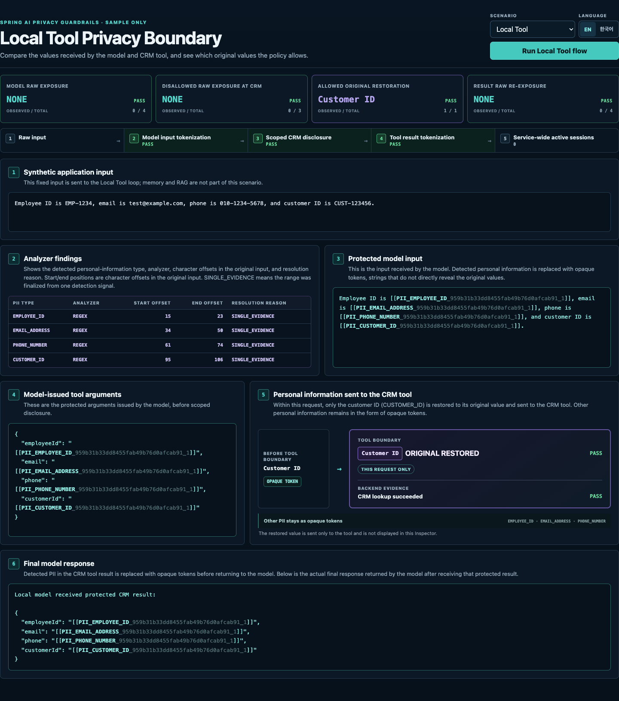
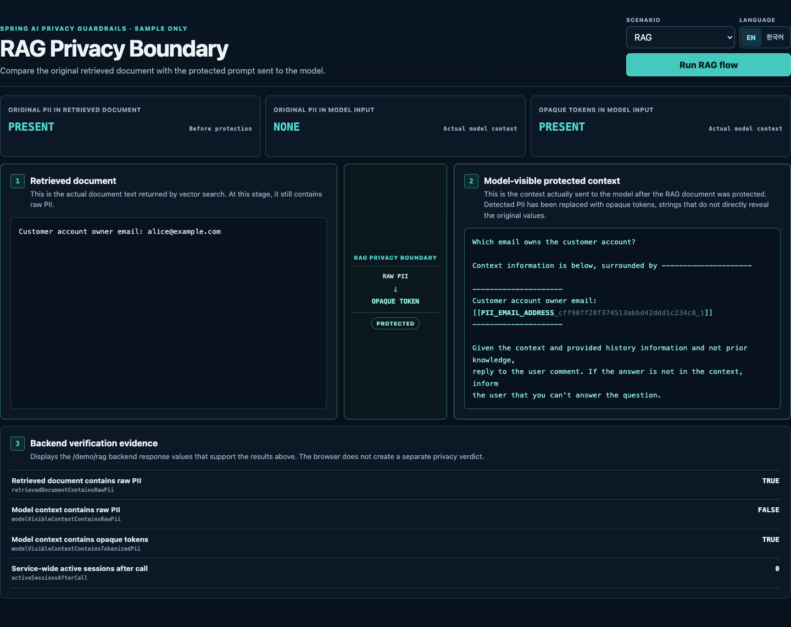
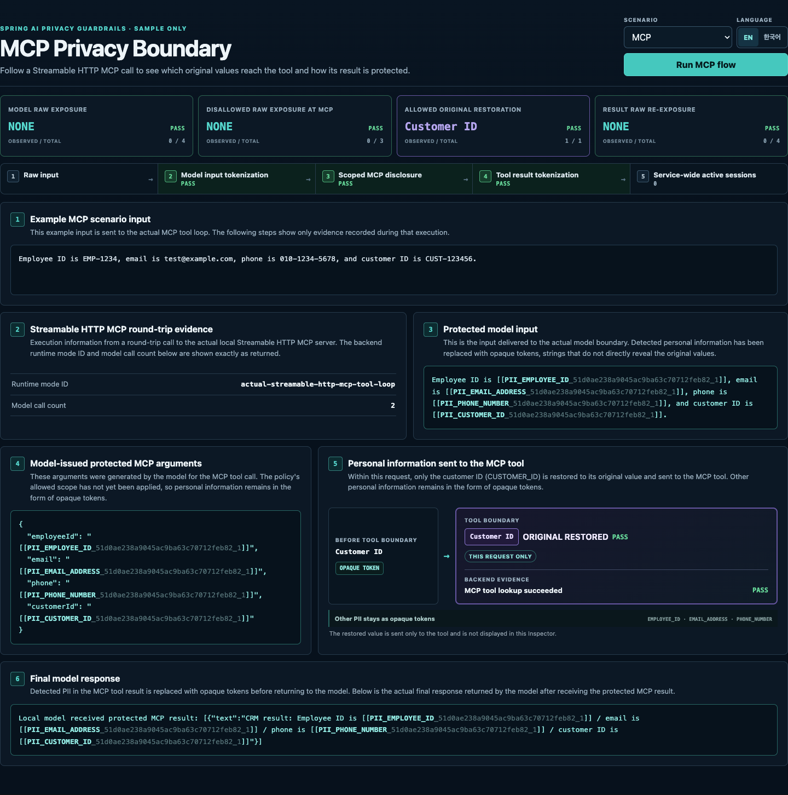

# Sample / Demo Guide

[English](sample.md) | [한국어](ko/sample.md)

The runnable sample uses a deterministic local `ChatModel`, in-memory RAG
components, and a loopback MCP server. No cloud credentials are required. Its
**Privacy Boundary Inspector** renders runtime evidence returned by the sample
backend; it does not expose token mappings or independently detect PII in the
browser. The RAG boundary state is calculated and displayed solely from evidence
returned by the sample backend.

## Run the Inspector

From the repository root, with JDK 21 installed:

```bash
./gradlew :spring-ai-privacy-guardrails-sample-demo:run
```

Open `http://127.0.0.1:8080`. The sample binds only to that loopback address.
Use the `Local Tool | RAG | MCP` selector to run a scenario, and use
`EN | 한국어` to rerun it with the selected runtime locale.

<div style="position: relative; width: 100%; aspect-ratio: 16 / 9;">
  <iframe
    src="https://www.youtube-nocookie.com/embed/IeeA5ogIX_I"
    title="Spring AI Privacy Guardrails English demo"
    style="position: absolute; inset: 0; width: 100%; height: 100%; border: 0;"
    loading="lazy"
    referrerpolicy="strict-origin-when-cross-origin"
    allow="accelerometer; autoplay; clipboard-write; encrypted-media; gyroscope; picture-in-picture; web-share"
    allowfullscreen>
  </iframe>
</div>

## Runtime Endpoints

| Endpoint | What it returns |
| --- | --- |
| `GET /demo/protect` | Analyzer spans and the tokenized EN or KO fixed fixture. This is a tokenization preview, not a model call. |
| `POST /demo/protect` | The same preview for a nonblank JSON `text` field. |
| `GET /demo/tool-loop` | Evidence from an actual protected `ChatClient` tool loop with an in-process CRM delegate. |
| `GET /demo/rag` | The raw retrieved document and the full protected prompt actually recorded by the local model. |
| `GET /demo/mcp-tool-loop` | Evidence from an actual local Streamable HTTP MCP tool loop. |

The Inspector also uses `GET /demo/scenario` to obtain the localized fixed
input. See the [full sample guide](https://github.com/ultramancode/spring-ai-privacy-guardrails/blob/main/samples/spring-ai-demo/README.md)
for request and response examples, optional analyzer profiles, and opt-in live
model verification.

## What Each Scenario Verifies

### Local Tool

The Inspector combines `/demo/scenario`, `/demo/protect`, and
`/demo/tool-loop`. For the fixed synthetic fixture, the tool-loop response
records that all four detected raw values are absent at the model boundary and
that opaque tokens are present. The model issues tokenized `employeeId`,
`email`, `phone`, and `customerId` arguments. Within that request, policy
restores only the allowed `CUSTOMER_ID`; the other three values remain tokens
when the in-process CRM delegate runs. The CRM result is tokenized again before
the second model call.

Each entry in the returned `boundaryEvidence` contains the observed count, the
total number of fixture values checked, and the resulting pass/fail status used
by the Inspector.



### RAG

The sample retrieves one fixed document containing `alice@example.com` from an
in-memory `SimpleVectorStore`. `retrievedDocument` is that raw retrieval result.
`modelVisibleContext` is the full query, prompt template, and retrieved context
recorded after privacy protection at the model boundary. The response shows the
raw email present in the retrieved document, absent from the model-visible
prompt, and replaced there by an opaque `EMAIL_ADDRESS` token.

This scenario verifies the model boundary, not protection of documents at rest.
It uses deterministic local embeddings and no external vector store, embedding
service, or LLM.



### MCP

The MCP scenario follows the same fixed tool policy through a real loopback HTTP
round trip. The application starts an embedded local server at `/mcp`, connects
with Streamable HTTP, discovers `customerLookup`, wraps its
`ToolCallbackProvider`, and executes one MCP tool call. Server-side evidence
confirms that only `CUSTOMER_ID` is restored while the other arguments remain
tokens. Evidence from the second model call confirms that detected values in the
MCP result are protected before model re-entry. The response identifies this
path as `actual-streamable-http-mcp-tool-loop`.

The server is embedded in the sample JVM and reused after its first call; this
is not a remote or separately deployed MCP service.



## EN/KO Runtime Locale

The Inspector sends `Accept-Language: en` or `ko` on every scenario request and
reruns the selected flow. The backend changes more than UI labels:

- Local Tool and MCP use localized fixed input and final-result wrappers.
- RAG uses localized queries, retrieved-document prefixes, and prompt templates.
- Endpoint paths, response field names, code identifiers, and entity types stay
  unchanged.

`POST /demo/protect` always analyzes its supplied `text`; the locale does not
replace custom input.

## Interpretation and Verification

The default Regex rules and all example values are sample-oriented. Text not
matched by an enabled analyzer may remain unchanged, and these fixed scenarios
do not establish general detection accuracy or prove protection for unsupported
execution paths.

For reproducible automated coverage, see the
[Privacy Boundary Verification Matrix](evaluation.md#privacy-boundary-verification-matrix).
