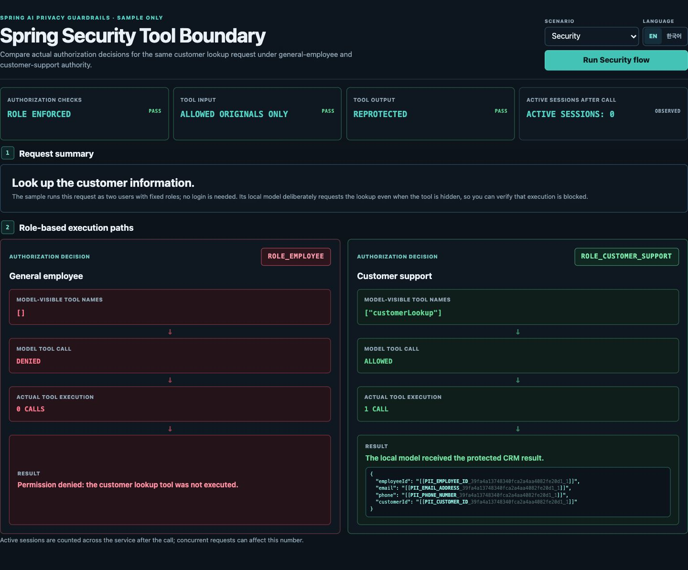

# Spring AI Privacy Guardrails Demo

[English](README.md) | [한국어](README.ko.md)

This runnable sample exercises the privacy advisor path with a deterministic
local `ChatModel`, so it requires no external LLM API key. It explicitly applies
the starter's privacy configurer and, for tool-bearing clients, its combined
`PrivacySecurityChatClientConfigurer`:

```text
raw user input -> tokenized model prompt -> capability-scoped tool disclosure
-> tool result retokenization
```

Demo responses do not serialize token mappings, but unmatched text can still be
returned unchanged. Custom text is accepted only in a POST body so it is not
copied into URLs, browser history, or ordinary access-log request lines.

Commands in this document assume a Linux shell and are run from the repository
root.

## Run

```bash
./gradlew :spring-ai-privacy-guardrails-sample-demo:run
```

The demo binds only to `http://127.0.0.1:8080`.

### Privacy Boundary Inspector

Open that URL in a browser to use the sample-only **Privacy Boundary
Inspector**. Use the `Local Tool | RAG | MCP | Security` selector to run the existing
runtime demos from one page. The `EN | 한국어` toggle sends the selected locale
to the demo endpoints and reruns the selected deterministic scenario so the UI
copy, synthetic input, and runtime results stay aligned. Each view renders only
evidence returned by its demo endpoints; the inspector does not expose token
mappings, recognizer internals, or model configuration.

<p align="center">
  
</p>

### Inspector Runtime Endpoints

| Inspector view | Backend requests | Returned runtime evidence |
| --- | --- | --- |
| `Local Tool` | `GET /demo/scenario`, `GET /demo/protect`, `GET /demo/tool-loop` | Localized fixed input and `detectedSpans`, opaque model input and tool arguments, scoped `CUSTOMER_ID` restoration, and the re-protected tool result. |
| `RAG` | `GET /demo/rag` | The raw `retrievedDocument`, the actual `modelVisibleContext`, and backend booleans that compare raw and tokenized PII at those two stages. |
| `MCP` | `GET /demo/scenario`, `GET /demo/mcp-tool-loop` | The actual local Streamable HTTP MCP runtime mode, protected model and tool-call values, scoped disclosure, and result re-protection. |
| `Security` | `GET /demo/security-tool-boundary` | Backend-recorded definition and execution decisions for the same customer lookup request as a general employee and a customer-support employee, callback counts, and privacy evidence from the allowed run. |

The Inspector sends `Accept-Language: en` or `ko` with these requests and
reruns the selected flow. The backend locale changes the fixed input, RAG
query and prompt template, and CRM result wrapper; it does not only translate
browser labels. The endpoint responses contain the evidence fields rendered by
the page, but never token mappings.

These runtime demonstrations complement the reproducible automated coverage in
the [Privacy Boundary Verification Matrix](../../docs/evaluation.md#privacy-boundary-verification-matrix).

## ChatClient With The Explicit Privacy Configurer

```bash
curl "http://127.0.0.1:8080/demo/chat-client"
```

This endpoint uses a Spring AI `ChatClient` with the starter's fixed privacy
advisor bundle. `modelResponse` shows the opaque tokens that reached the model.
`activeSessionsAfterCall` is the service-wide active session count observed
after the call; the isolated sample normally reports `0`, but concurrent calls
can make it nonzero without indicating that this request leaked a session.

Custom synthetic text can be sent with `POST /demo/chat-client` and a JSON body
such as `{"text":"My employee id is EMP-1234"}`. The `GET /demo/chat-client`
endpoint runs its checked-in fixed example; POST requests with missing
or blank `text` are rejected with HTTP `400` rather than silently substituting
that example.

## Local RAG Boundary Demo

```bash
curl "http://127.0.0.1:8080/demo/rag" \
  -H 'Accept-Language: en'
```

This endpoint retrieves a fixed synthetic document from an in-memory
`SimpleVectorStore`. The response includes the raw retrieved document and the
tokenized context actually received by the deterministic local model. This
confirms that retrieved PII is tokenized before model execution. No external
vector store, embedding service, or model is used.

## Regex-Only Protection

```bash
curl "http://127.0.0.1:8080/demo/protect" \
  -H 'Accept-Language: en'
```

`GET /demo/protect` selects its deterministic English or Korean fixture from
`Accept-Language`; this command pins the English fixture used below.

Expected shape:

```json
{
  "protectedPrompt": "Employee ID is [[PII_EMPLOYEE_ID_<32-hex-session-nonce>_1]], email is [[PII_EMAIL_ADDRESS_<32-hex-session-nonce>_1]], phone is [[PII_PHONE_NUMBER_<32-hex-session-nonce>_1]], and customer ID is [[PII_CUSTOMER_ID_<32-hex-session-nonce>_1]].",
  "detectedSpans": [
    {"type":"EMPLOYEE_ID","start":15,"end":23,"providers":["REGEX"],"reason":"SINGLE_EVIDENCE"},
    {"type":"EMAIL_ADDRESS","start":34,"end":50,"providers":["REGEX"],"reason":"SINGLE_EVIDENCE"},
    {"type":"PHONE_NUMBER","start":61,"end":74,"providers":["REGEX"],"reason":"SINGLE_EVIDENCE"},
    {"type":"CUSTOMER_ID","start":95,"end":106,"providers":["REGEX"],"reason":"SINGLE_EVIDENCE"}
  ],
  "successfulProviders": ["REGEX"]
}
```

This concrete token string shape is not a public contract; application logic
must not parse it or otherwise depend on it.

The session nonce is generated again for every request. Calling the endpoint
twice with the same input must produce different opaque tokens.
Each span's `providers` list contains only canonical analyzer provider IDs from
the resolved evidence.

The default configuration uses small, format-based regex rules for:

- Email addresses.
- Korean mobile phone numbers.
- Synthetic Korean resident registration number format.
- Employee IDs such as `EMP-1234`.
- Customer IDs such as `CUST-123456`.

The same default profile can protect structured identifiers inside synthetic
English text without adding an external analyzer:

```bash
curl -X POST http://127.0.0.1:8080/demo/protect \
  -H 'Content-Type: application/json' \
  -d '{"text":"Email alice@example.com, phone 010-2345-6789, customer ID CUST-654321, employee ID EMP-1234."}'
```

The response should contain `EMAIL_ADDRESS`, `PHONE_NUMBER`, `CUSTOMER_ID`,
and `EMPLOYEE_ID` tokens. Person names are semantic entities rather than stable
identifier formats, so the regex-only profile does not guess them. Use a
configured NER provider such as Presidio or the optional OpenNLP profile below
when `PERSON` detection is required.

These rules are sample-oriented; production systems should tune them for their
own data or add custom `PiiAnalyzer` beans. The checked-in
[evaluation baseline](../../docs/evaluation.md) covers positive, negative, and
adversarial synthetic cases using this configuration.

## ChatClient Tool Loop Demo

```bash
curl "http://127.0.0.1:8080/demo/tool-loop" \
  -H 'Accept-Language: en'
```

The response shows that the fixed fixture's detected values reach the model
only as opaque tokens. Within the current request, the CRM delegate receives
the original `customerId` while `employeeId`, `email`, and `phone` remain
opaque tokens. Detected values in the tool result are protected before the next
model call. `activeSessionsAfterCall` is the service-wide active session count
observed after the call; concurrent requests can make it nonzero without
showing that this request leaked a session.

Disclosure scope comes from `spring.ai.privacy.tools.disclosures`; the demo uses the
auto-configured `PrivacyToolCallbackFactory` and combined
`PrivacySecurityChatClientConfigurer` rather than creating parallel policies.

The `/demo/tool-loop` endpoint uses an in-process CRM delegate.

## Spring Security Tool Boundary Demo

```bash
curl "http://127.0.0.1:8080/demo/security-tool-boundary" \
  -H 'Accept-Language: en'
```

This endpoint runs the same deterministic customer lookup request twice. For a
general employee (`ROLE_EMPLOYEE`), `customerLookup` is absent from the
model-visible definitions and the forced request is denied before the callback
runs. For a customer-support employee (`ROLE_CUSTOMER_SUPPORT`), the tool is
exposed and executed once; the existing disclosure policy restores only
`CUSTOMER_ID`, and the result is protected again before model re-entry. The
sample installs a fixed in-process authorization policy and requires no login,
token issuer, external model, or external service.

<p align="center">
  
</p>

## Streamable HTTP MCP Tool Loop Demo

```bash
curl "http://127.0.0.1:8080/demo/mcp-tool-loop" \
  -H 'Accept-Language: en'
```

This endpoint runs the same deterministic flow through an actual local
Streamable HTTP MCP round trip. Its evidence shows the fixed fixture's detected
raw values absent at the model, only `CUSTOMER_ID` restored at the MCP tool, and
detected values in the MCP result protected before model re-entry. It also
reports the service-wide active session count observed after the call. It
requires no external MCP infrastructure or model.

## Opt-In OpenAI-Compatible Live Model Verification

The opt-in live harness connects Spring AI's `OpenAiChatModel` to an
application-supplied OpenAI-compatible endpoint. The checked-in `.env.example`
uses Gemini's compatible endpoint as one verified configuration without a
Google-native model adapter. Other endpoints must support chat completions,
streaming, and tool calling.

Normal builds require no cloud credentials and never contact the endpoint. To
run it deliberately, copy the template and put a temporary test key only in the
ignored local file.

```bash
cp samples/spring-ai-demo/.env.example samples/spring-ai-demo/.env
chmod 600 samples/spring-ai-demo/.env
# Edit samples/spring-ai-demo/.env and fill in OPENAI_COMPATIBLE_API_KEY.
./gradlew :spring-ai-privacy-guardrails-sample-demo:openAiCompatibleLiveTest
```

The task requires `OPENAI_COMPATIBLE_API_KEY`,
`OPENAI_COMPATIBLE_BASE_URL`, and `OPENAI_COMPATIBLE_MODEL`. Existing process
environment variables take precedence over values in the ignored local file.

The harness covers blocking, streaming, tool-loop, and `returnDirect` paths. It
checks model-bound protection, scoped CRM disclosure, result retokenization,
application output policy, and session cleanup. Successful summaries omit
payloads and credentials. Provider and JUnit failures retain original SDK
diagnostics, so failed-run logs may contain endpoint responses.

## Optional Presidio Adapter

Start the local Presidio analyzer:

```bash
docker compose -f samples/presidio/docker-compose.yml up -d --wait
```

Then run the demo with the `presidio` profile:

```bash
./gradlew :spring-ai-privacy-guardrails-sample-demo:run --args='--spring.profiles.active=presidio'
```

Once this optional profile is enabled, the default `REQUIRE_ALL` policy makes
Presidio availability mandatory for every analysis request; an outage fails
closed even if regex succeeds. The profile uses language `en`, spaCy
`en_core_web_lg`, and a provider-specific minimum score of `0.8`. Production
deployments should calibrate that threshold with representative synthetic data.

Korean regex rules remain active, but this sample does not provide Korean
Presidio NER support. A production Korean deployment must install and configure
a compatible Korean NLP and recognizer pipeline.

## Optional JVM-Only OpenNLP Adapter

The `opennlp` profile exercises the optional in-process adapter with
application-supplied tokenizer and name-finder models. The repository does not
bundle or redistribute model binaries. For a local smoke test, download the
English tokenizer and person models from the
[Apache OpenNLP legacy model catalog](https://opennlp.sourceforge.net/models-1.5/)
into the ignored `build` directory:

```bash
mkdir -p build/manual-opennlp-models
curl -fL https://opennlp.sourceforge.net/models-1.5/en-token.bin \
  -o build/manual-opennlp-models/en-token.bin
curl -fL https://opennlp.sourceforge.net/models-1.5/en-ner-person.bin \
  -o build/manual-opennlp-models/en-ner-person.bin
printf '%s  %s\n' \
  2d0dd64ffb3d084382d7bdb65e7bd004c5001ba5503c36413d97c3e46321437c \
  build/manual-opennlp-models/en-token.bin \
  687a9263d96b37fced707c9f2ac0560f9edaf54658856395555901924f64dbe4 \
  build/manual-opennlp-models/en-ner-person.bin \
  | sha256sum -c -
```

Then pass their absolute file URIs and activate the profile:

```bash
export OPENNLP_TOKENIZER_MODEL="file:$PWD/build/manual-opennlp-models/en-token.bin"
export OPENNLP_PERSON_MODEL="file:$PWD/build/manual-opennlp-models/en-ner-person.bin"
./gradlew :spring-ai-privacy-guardrails-sample-demo:run \
  --args='--spring.profiles.active=opennlp'
```

In another terminal, send synthetic English text:

```bash
curl -X POST http://127.0.0.1:8080/demo/protect \
  -H 'Content-Type: application/json' \
  -d '{"text":"John Smith joined the board."}'
```

The response should replace `John Smith` with a `PERSON` token. Its detected
span should cover offsets `0..10` and report `providers: ["OPENNLP"]`.
`successfulProviders` contains both `OPENNLP` and `REGEX`: the OpenNLP model
found the span, while the still-enabled regex analyzer also completed
successfully without contributing evidence to that span.

The profile's `0.8` OpenNLP threshold and these Apache-hosted legacy English
models are only a reproducible smoke-test baseline. They are not a
general-purpose PII recommendation. Before production use, the application
must review model provenance and licensing, use a tokenizer compatible with
the NER model, and calibrate accuracy on representative synthetic data.

To run the opt-in integration test against those same files:

```bash
OPENNLP_LIVE_TEST=true \
OPENNLP_TOKENIZER_MODEL="$OPENNLP_TOKENIZER_MODEL" \
OPENNLP_PERSON_MODEL="$OPENNLP_PERSON_MODEL" \
./gradlew :spring-ai-privacy-guardrails-sample-demo:test --rerun-tasks
```
